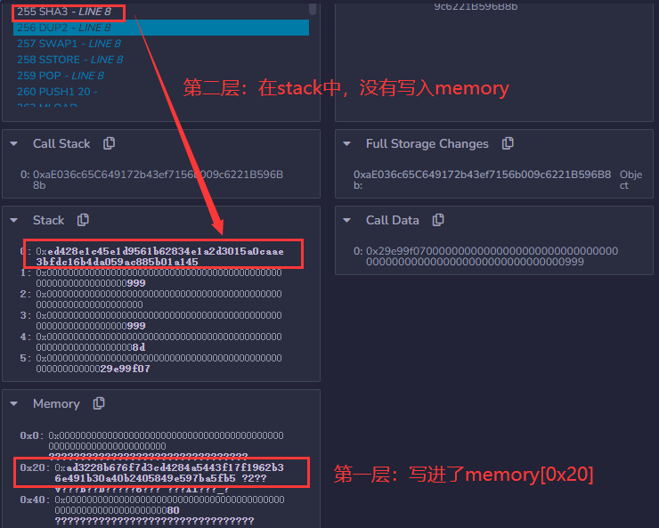

# ChildOtter

做题时只是用debug查了下memory中0x20的值是0xad3228b676f7d3cd4284a5443f17f1962b36e491b30a40b2405849e597ba5fb5，因为`target=mload(32)`，直接取内存中0x20~0x40的值。

赛后仔细观察val[0] [0] = x;的赋值过程发现，会先计算第一层映射值的插槽储存在memory0x20中，用于计算第二层映射值的插槽，然后sstore，第二层的映射位置没有写入memory而是存在于stack用了就丢弃。



原理：对应文档中的映射值得插槽计算方法通过`keccak256(abi.encodePacked(uint(key),uint(slot)))`可以算出 第一层映射值得插槽为：0xad3228b676f7d3cd4284a5443f17f1962b36e491b30a40b2405849e597ba5fb5，第二层映射插槽为：0xed428e1c45e1d9561b62834e1a2d3015a0caae3bfdc16b4da059ac885b01a145

```Solidity
// SPDX-License-Identifier: UNLICENSED
pragma solidity ^0.8.13;
interface IChildOtter {
    function solve(uint x) external;
}

contract Exploit {
    function exploit() public {
        // write code here
        address target = 0x63461D5b5b83bD9BA102fF21d8533b3aad172116;
        IChildOtter(target).solve(
            0xad3228b676f7d3cd4284a5443f17f1962b36e491b30a40b2405849e597ba5fb5
        );
    }
}
```
