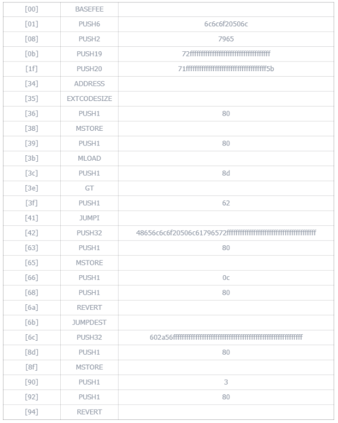
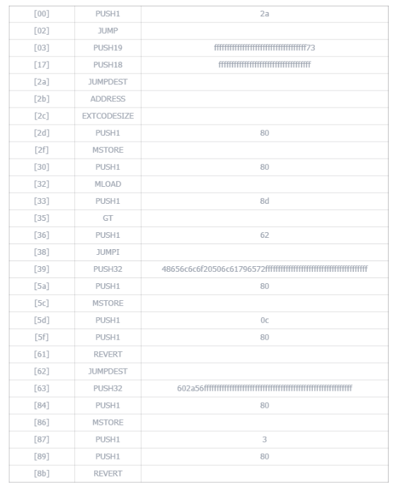

# Bytedance

完成题目需要跑通过两次staticcall返回不同的值。

第一次会把"Hello Player"和target的字节码打包创建一个新的合约。”Hello Player“的bytes表示为 0x48656c6c6f20506c61796572 转换为字节码为：

| [00] | BASEFEE |              |
| ---- | ------- | ------------ |
| [01] | PUSH6   | 6c6c6f20506c |
| [08] | PUSH2   | 7965         |
| [0b] | PUSH19  |              |

可以看到前面这些字节码无伤大雅 只需要填充19字节就可以直接按照我们的逻辑来编写。

第二次把"`*V"和target的字节码打包创建一个新合约。"`*V"的bytes表示为0x602a56 转换为字节码为：

| [00] | PUSH1 | 2a   |
| ---- | ----- | ---- |
| [02] | JUMP  |      |

发现字节码会直接跳转到2a的地方继续执行，那么字节码中必须由jumpdest ，但是第一个打包中没有jump。

我首先考虑控制push19 和 jumpdest中间的字段，让第一次打包后jumpdest被覆盖进push的内容中，而第二次打包jumpdest在正确的位置，之后按照自身字节码长度来判断应该返回的值。

我构造了如下字节码：

```
0x72ffffffffffffffffffffffffffffffffffff7371ffffffffffffffffffffffffffffffffffff5b303b608052608051608d116062577f48656c6c6f20506c61796572ffffffffffffffffffffffffffffffffffffffff608052600c6080fd5b7f602a56ffffffffffffffffffffffffffffffffffffffffffffffffffffffffff60805260036080fd
```

第一次打包后为：



第二次打包后为：



最后还要解决的一个问题是要求setup target时地址代码长度要求0，我们可以在构造函数中调用setup，这样由于合约还未完成部署，检测的代码长度为0。

攻击合约：

```solidity
// SPDX-License-Identifier: UNLICENSED
pragma solidity ^0.8.13;

interface IBytedance {
    function solve() external;

    function setup() external;
}

contract Exploit {
    function exploit() public {
        address target = 0x2eB0fCb87fe17e7a2aB93B6d51C0A72D9dbA6bdC;
        bytes
            memory code = hex"72ffffffffffffffffffffffffffffffffffff7371ffffffffffffffffffffffffffffffffffff5b303b608052608051608d116062577f48656c6c6f20506c61796572ffffffffffffffffffffffffffffffffffffffff608052600c6080fd5b7f602a56ffffffffffffffffffffffffffffffffffffffffffffffffffffffffff60805260036080fd";
        Helper helper = new Helper(code);

        IBytedance(target).solve();
    }
}

contract Helper {
    constructor(bytes memory a) public payable {
        address target = 0x2eB0fCb87fe17e7a2aB93B6d51C0A72D9dbA6bdC;
        IBytedance(target).setup();
        assembly {
            return(add(0x20, a), mload(a))
        }
    }
}
```

赛后想了下应该有更简单的构造方法，比如在jumpdest之前返回0x48656c6c6f20506c61796572，jumpdest之后返回0x602a56，并且用RETURN返回数据更好，当然本处使用了REVERT一样可行。

