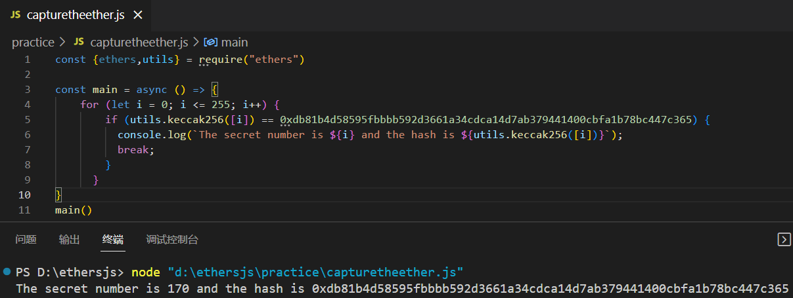

# Guess the secret number

## topic

```solidity
pragma solidity ^0.4.21;

contract GuessTheSecretNumberChallenge {
    bytes32 answerHash = 0xdb81b4d58595fbbbb592d3661a34cdca14d7ab379441400cbfa1b78bc447c365;

    function GuessTheSecretNumberChallenge() public payable {
        require(msg.value == 1 ether);
    }
    
    function isComplete() public view returns (bool) {
        return address(this).balance == 0;
    }

    function guess(uint8 n) public payable {
        require(msg.value == 1 ether);

        if (keccak256(n) == answerHash) {
            msg.sender.transfer(2 ether);
        }
    }
}
```

## analyses

we need to guess a number which returns `0xdb81b4d58595fbbbb592d3661a34cdca14d7ab379441400cbfa1b78bc447c365` after keccak256(). we can brute force it because the type of guess numer is uint8 which means there are only 256 probabilities.

## solution

1.find the correct number off-chain

```js
const {ethers,utils} = require("ethers")

const main = async () => {
    for (let i = 0; i <= 255; i++) {
        if (utils.keccak256([i]) == 0xdb81b4d58595fbbbb592d3661a34cdca14d7ab379441400cbfa1b78bc447c365) {
          console.log(`The secret number is ${i} and the hash is ${utils.keccak256([i])}`);
          break;
        }
      }
}
main()
```



2.call `guess(uint8)` with the parameter "170" and 1 ETH


