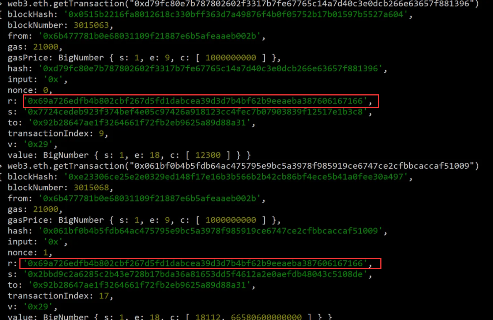

# Account Takeover

## topic

```solidity
pragma solidity ^0.4.21;

contract AccountTakeoverChallenge {
    address owner = 0x6B477781b0e68031109f21887e6B5afEAaEB002b;
    bool public isComplete;

    function authenticate() public {
        require(msg.sender == owner);

        isComplete = true;
    }
}
```

## analyses

本道题是要找到owner的私钥，也就是部署这个合约的用户的私钥。因为ropsten测试网已经停用了，但是根据其他的解题文章，我们知道，在此测试网中，头两笔交易使用了相同的随机数k生成了相同的r值(vrs中的r)，这就出问题了：

- 每一个交易都可以解析出vrs，并且r必须是不同的，它是由随机数k来生成的，否则使用重复的r会被推导出私钥，让我们来写脚本来破解此题

  - r：两笔交易相同的r

  - s：s1和s2分别是两笔交易的s

  - z：根据脚本获得


然后根据脚本来解析反推私钥

本题主要是学习根据相同的r可以反推私钥，并且积累脚本代码，具体的数学和密码学逻辑过于复杂，我暂时没能力去自己造轮子，所以，共勉

## solution

1.获取头两笔交易的详情：



2.获得z

```js
const EthereumTx = require('ethereumjs-tx')

var rawTx1 =  
    { nonce: 0,  
     gasPrice: '0x3b9aca00',  
     gasLimit: '0x5208',  
     to: '0x92b28647ae1f3264661f72fb2eb9625a89d88a31',  
     value: '0x1111d67bb1bb0000',  
     data: '0x',  
     v: 41,  
     r: '0x69a726edfb4b802cbf267d5fd1dabcea39d3d7b4bf62b9eeaeba387606167166',  
     s: '0x7724cedeb923f374bef4e05c97426a918123cc4fec7b07903839f12517e1b3c8'  
}  
var rawTx2 =  
    { nonce: 1,  
     gasPrice: '0x3b9aca00',  
     gasLimit: '0x5208',  
     to: '0x92b28647ae1f3264661f72fb2eb9625a89d88a31',  
     value: '0x1922e95bca330e00',  
     data: '0x',  
     v: 41,  
     r: '0x69a726edfb4b802cbf267d5fd1dabcea39d3d7b4bf62b9eeaeba387606167166',  
     s: '0x2bbd9c2a6285c2b43e728b17bda36a81653dd5f4612a2e0aefdb48043c5108de'  
}  
tx1 = new EthereumTx(rawTx1,{ chain: 'ropsten'});  
  
tx2 = new EthereumTx(rawTx2,{ chain: 'ropsten'});  
  
z1=tx1.hash(false).toString("hex");  
z2=tx2.hash(false).toString("hex");  
console.log(z1);  
console.log(z2);
```

结果：

```
350f3ee8007d817fbd7349c477507f923c4682b3e69bd1df5fbb93b39beb1e04 // z1
4f6a8370a435a27724bbc163419042d71b6dcbeb61c060cc6816cda93f57860c // z2
```

3.反推私钥

```python
r = 0x69a726edfb4b802cbf267d5fd1dabcea39d3d7b4bf62b9eeaeba387606167166
z1 = 0x4f6a8370a435a27724bbc163419042d71b6dcbeb61c060cc6816cda93f57860c
s1 = 0x2bbd9c2a6285c2b43e728b17bda36a81653dd5f4612a2e0aefdb48043c5108de
z2 = 0x350f3ee8007d817fbd7349c477507f923c4682b3e69bd1df5fbb93b39beb1e04
s2 = 0x7724cedeb923f374bef4e05c97426a918123cc4fec7b07903839f12517e1b3c8

n  = 0xFFFFFFFFFFFFFFFFFFFFFFFFFFFFFFFEBAAEDCE6AF48A03BBFD25E8CD0364141

def modinv(x, n=n): return pow(x, n-2, n)  # modular multiplicative inverse (requires that n is prime)

k = (z1 - z2) * modinv(s1 - s2) % n ; print('k = {:x}'.format(k))
print('privkey = {:x}'.format( (s1 * k - z1) * modinv(r) % n ))  # these two should
print('privkey = {:x}'.format( (s2 * k - z2) * modinv(r) % n ))  # be the same
```

得到私钥：`614f5e36cd55ddab0947d1723693fef5456e5bee24738ba90bd33c0c6e68e269`

4.用此私钥导入metamask钱包，用此用户就可以调用isComplete()方法了


