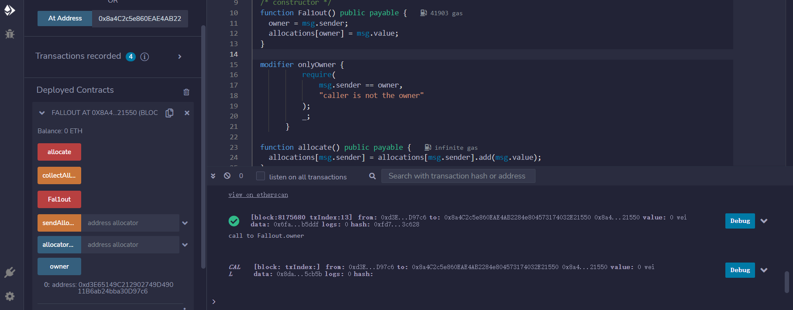
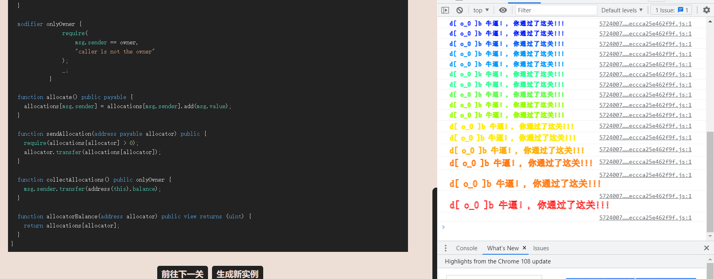
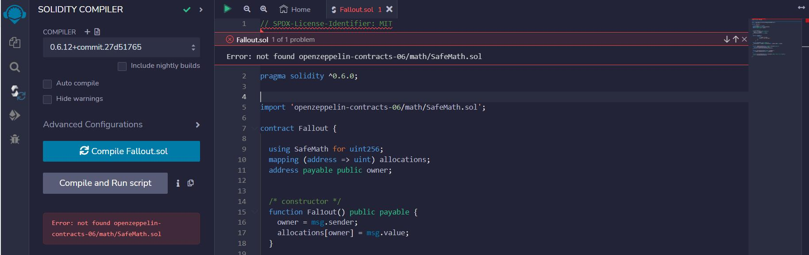

# Fallout

## 题目

通关要求：夺取owner

```solidity
// SPDX-License-Identifier: MIT
pragma solidity ^0.6.0;

import 'openzeppelin-contracts-06/math/SafeMath.sol';

contract Fallout {
  
  using SafeMath for uint256;
  mapping (address => uint) allocations;
  address payable public owner;


  // constructor 
  function Fal1out() public payable {
    owner = msg.sender;
    allocations[owner] = msg.value;
  }

  modifier onlyOwner {
	        require(
	            msg.sender == owner,
	            "caller is not the owner"
	        );
	        _;
	    }

  function allocate() public payable {
    allocations[msg.sender] = allocations[msg.sender].add(msg.value);
  }

  function sendAllocation(address payable allocator) public {
    require(allocations[allocator] > 0);
    allocator.transfer(allocations[allocator]);
  }

  function collectAllocations() public onlyOwner {
    msg.sender.transfer(address(this).balance);
  }

  function allocatorBalance(address allocator) public view returns (uint) {
    return allocations[allocator];
  }
}
```

## 分析

老样子先看编译器版本^0.6.0，那么就可能出现整数溢出漏洞。但是我们看到它引用了Safemath库，那么排除整数溢出这个可能了。

然后我们看看哪里可以修改owner，嗯，找不到一个方法。嗯？？？`function Fal1out()`是什么鬼？特么的构造器名字都可以写错。那么这就不是构造器了，这就是一个方法，直接调用就修改了owner了。

这道题应该是告诉我们，0.8.0之后的版本，构造器是用`constructor`，而不是这个可能打错字的形式。

## 做题

获取题目实例地址，输入到At address，然后调用`Fal1out`方法。然后调用owner发现，owner已经被修改成我们的地址



通过



## 小插曲

- 有人遇到过这个问题吗？题目代码复制过来报错
- 引oz的包要加@
- 试过了还是不行
- 试过了好几个stackoverflow的路径都显示不对
- 而且我觉得不可以修改这个源代码，不然题目不认
- 只是一个safemath的包，除非题目自己重写了safemath
- 你是找0.6的safemath是吧
- 你直接放到合约里面去或者放在自己remix目录都行



```solidity
pragma solidity ^0.6.0;

library SafeMath {

    function add(uint256 a, uint256 b) internal pure returns (uint256) {
        uint256 c = a + b;
        require(c >= a, "SafeMath: addition overflow");

        return c;
    }

    function sub(uint256 a, uint256 b) internal pure returns (uint256) {
        return sub(a, b, "SafeMath: subtraction overflow");
    }

    function sub(uint256 a, uint256 b, string memory errorMessage) internal pure returns (uint256) {
        require(b <= a, errorMessage);
        uint256 c = a - b;

        return c;
    }
    function mul(uint256 a, uint256 b) internal pure returns (uint256) {
        if (a == 0) {
            return 0;
        }

        uint256 c = a * b;
        require(c / a == b, "SafeMath: multiplication overflow");

        return c;
    }
    function div(uint256 a, uint256 b) internal pure returns (uint256) {
        return div(a, b, "SafeMath: division by zero");
    }

    function div(uint256 a, uint256 b, string memory errorMessage) internal pure returns (uint256) {
        require(b > 0, errorMessage);
        uint256 c = a / b;
        //  assert(a == b * c + a % b); // There is no case in which this doesn't hold

        return c;
    }

    function mod(uint256 a, uint256 b) internal pure returns (uint256) {
        return mod(a, b, "SafeMath: modulo by zero");
    }


    function mod(uint256 a, uint256 b, string memory errorMessage) internal pure returns (uint256) {
        require(b != 0, errorMessage);
        return a % b;
    }
}
```


[题目原地址](https://ethernaut.openzeppelin.com/level/0x0AA237C34532ED79676BCEa22111eA2D01c3d3e7)


