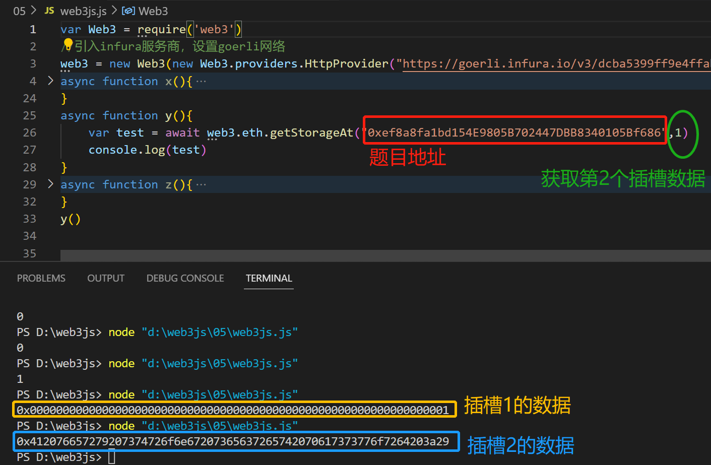
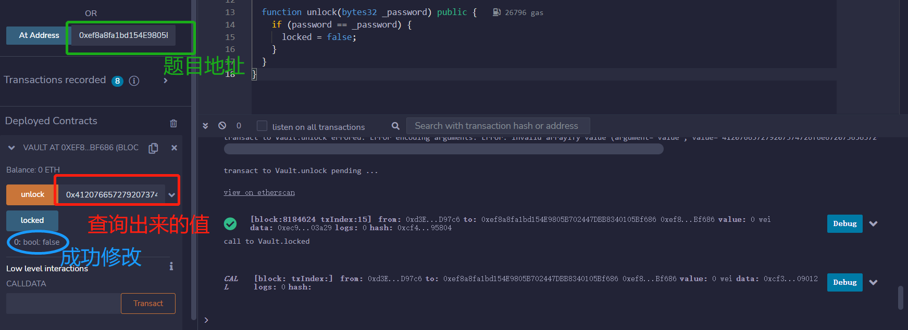
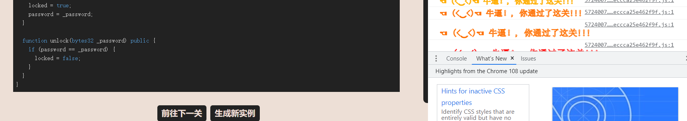

# Vault

## 题目

目标：打开 vault 来通过这一关!

```solidity
// SPDX-License-Identifier: MIT
pragma solidity ^0.8.0;

contract Vault {
  bool public locked;
  bytes32 private password;

  constructor(bytes32 _password) {
    locked = true;
    password = _password;
  }

  function unlock(bytes32 _password) public {
    if (password == _password) {
      locked = false;
    }
  }
}
```

## 分析

这道题的目的是将locked的值从true改成false，那么方法unlock就可以做到。这个方法需要传入一个参数，这个参数等于password才可以修改locked。那么我们就需要知道password的值。但是password类型为private，不可以直接查看。但是区块链上的数据都是公开透明的，我们可以查。

我们使用web3js来查找。这里需要我们懂得智能合约上状态变量的存储是以插槽的形式的。那么在这道题，bool类型的变量locked是在`slot 0`，bytes32类型的变量password是在`slot 1`。那么我们查找slot 1的数据即是password。

## 做题

获取密码



部署，攻击



通过


