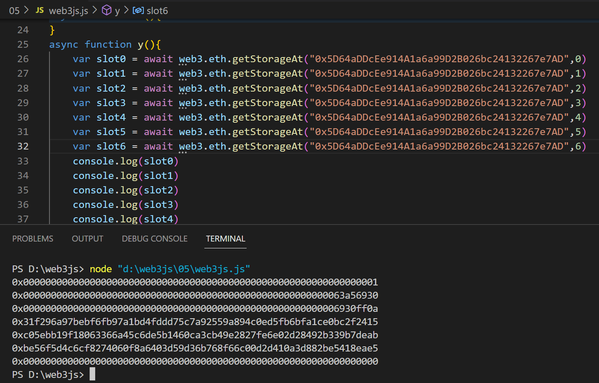
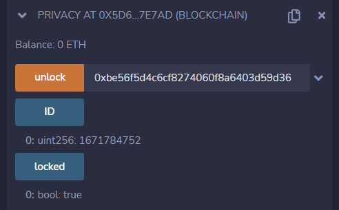
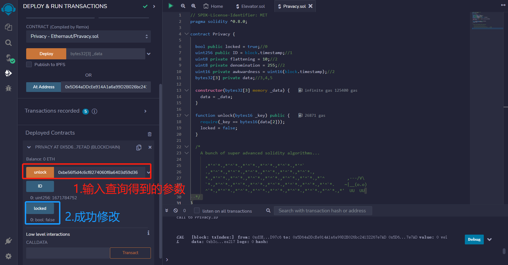
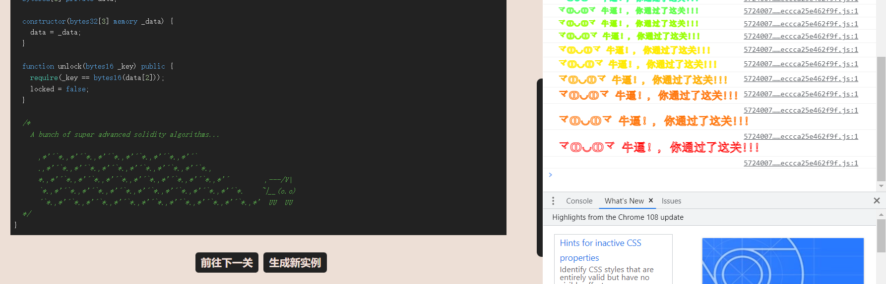

# Privacy

## 题目

目标：将locked修改为false。

```solidity
// SPDX-License-Identifier: MIT
pragma solidity ^0.8.0;

contract Privacy {

  bool public locked = true;
  uint256 public ID = block.timestamp;
  uint8 private flattening = 10;
  uint8 private denomination = 255;
  uint16 private awkwardness = uint16(block.timestamp);
  bytes32[3] private data;

  constructor(bytes32[3] memory _data) {
    data = _data;
  }
  
  function unlock(bytes16 _key) public {
    require(_key == bytes16(data[2]));
    locked = false;
  }

  /*
    A bunch of super advanced solidity algorithms...

      ,*'^`*.,*'^`*.,*'^`*.,*'^`*.,*'^`*.,*'^`
      .,*'^`*.,*'^`*.,*'^`*.,*'^`*.,*'^`*.,*'^`*.,
      *.,*'^`*.,*'^`*.,*'^`*.,*'^`*.,*'^`*.,*'^`*.,*'^         ,---/V\
      `*.,*'^`*.,*'^`*.,*'^`*.,*'^`*.,*'^`*.,*'^`*.,*'^`*.    ~|__(o.o)
      ^`*.,*'^`*.,*'^`*.,*'^`*.,*'^`*.,*'^`*.,*'^`*.,*'^`*.,*'  UU  UU
  */
}
```

## 分析

这道题要我们将locked从true修改为false，只有unlock这个方法可以。但是这个方法需要传入一个参数，满足条件才可以修改

条件`_key == bytes16(data[2])`：我们需要知道data数组的第三个元素的数据。但是这个数据是private的，所以我们需要用web3js进行查询。查询的插槽情况如下，data[2]数据所在的插槽是slot5。即：`0xbe56f5d4c6cf8274060f8a6403d59d36b768f66c00d2d410a3d882be5418eae5`



同时，因为是bytes16截取，而data数组本身每一个元素是bytes32，因此bytes16会截取前面32位。（从前面开始截取，这是ABI编码的规则）。因此参数应该输入为：`0xbe56f5d4c6cf8274060f8a6403d59d36`

## 做题

获取实例，部署，初始状态如下：



输入参数0xbe56f5d4c6cf8274060f8a6403d59d36，调用。成功修改



通过


