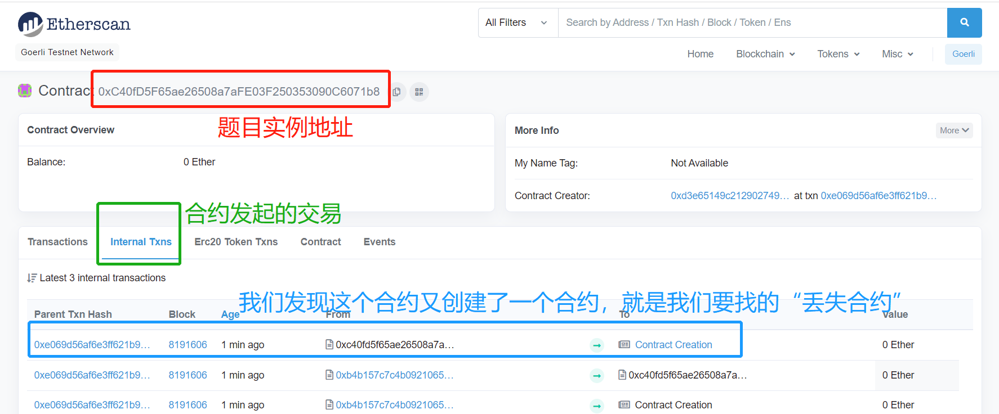
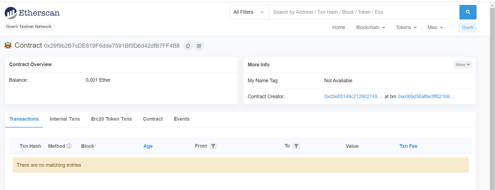
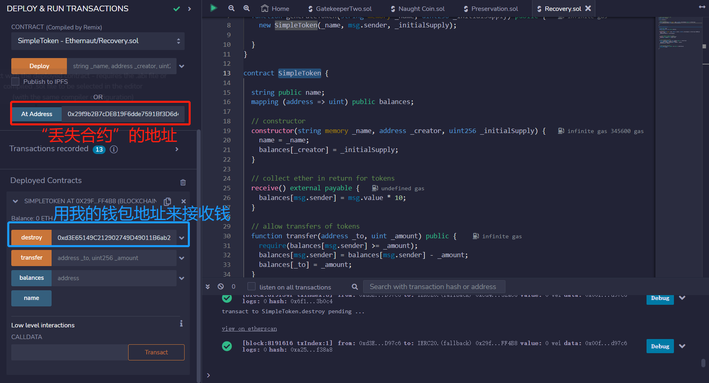
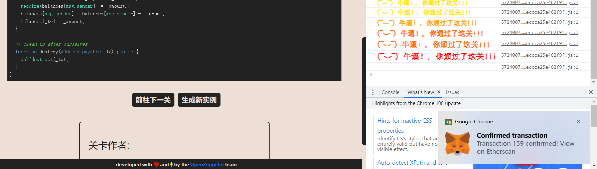
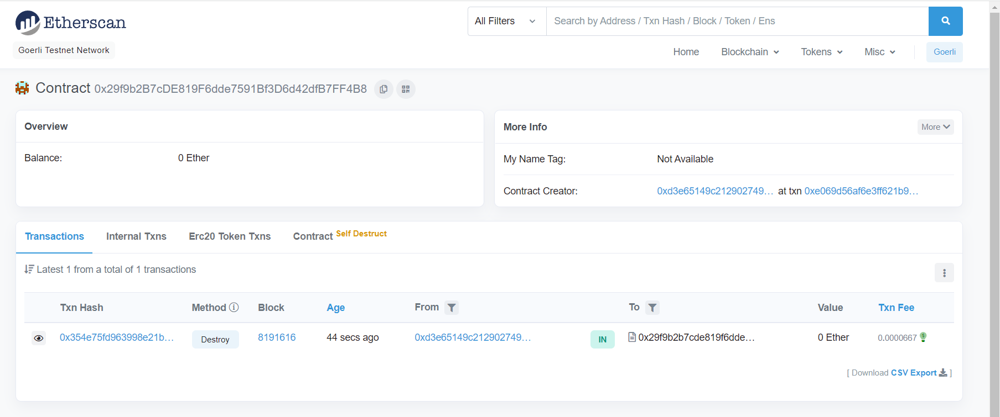

# Recovery

## 题目

目标：

题目Recovery是一个工厂，可以不断的造SimpleToken合约。但是造出来SimpleToken合约之后，却不知道地址。

要求：题目造了一个SimpleToken合约，请你找到他，并且destroy他

```solidity
// SPDX-License-Identifier: MIT
pragma solidity ^0.8.0;

contract Recovery {

  //generate tokens
  function generateToken(string memory _name, uint256 _initialSupply) public {
    new SimpleToken(_name, msg.sender, _initialSupply);
  
  }
}

contract SimpleToken {

  string public name;
  mapping (address => uint) public balances;

  // constructor
  constructor(string memory _name, address _creator, uint256 _initialSupply) {
    name = _name;
    balances[_creator] = _initialSupply;
  }

  // collect ether in return for tokens
  receive() external payable {
    balances[msg.sender] = msg.value * 10;
  }

  // allow transfers of tokens
  function transfer(address _to, uint _amount) public { 
    require(balances[msg.sender] >= _amount);
    balances[msg.sender] = balances[msg.sender] - _amount;
    balances[_to] = _amount;
  }

  // clean up after ourselves
  function destroy(address payable _to) public {
    selfdestruct(_to);
  }
}
```

## 分析&做题

我们发现，造合约的函数new之后没有用一个参数进行接收，那么我们就没有办法通过此合约得到造出来的这个合约地址。

但你懂的，区块链上很多东西都可以查，当然造了一个合约出来，难道会查不到？通过区块链浏览器，我们可以找到这个“丢失的”合约。

（1）得到题目实例地址：0xC40fD5F65ae26508a7aFE03F250353090C6071b8。既然丢失的SimpleToken合约是题目实例创建的，那么它肯定发起过交易来创建，我们在区块链浏览器查看题目实例地址



看一眼新建的SimpleToken合约



拿到了“丢失合约”，那么就destroy吧



通过



再看一眼SimpleToken合约



## 真正做题

通过区块链浏览器来查看真没意思。创建合约当然是有自己的一套规则的，那么让我们来通过这一套规则，自己手动算出来丢失的合约地址吧！


