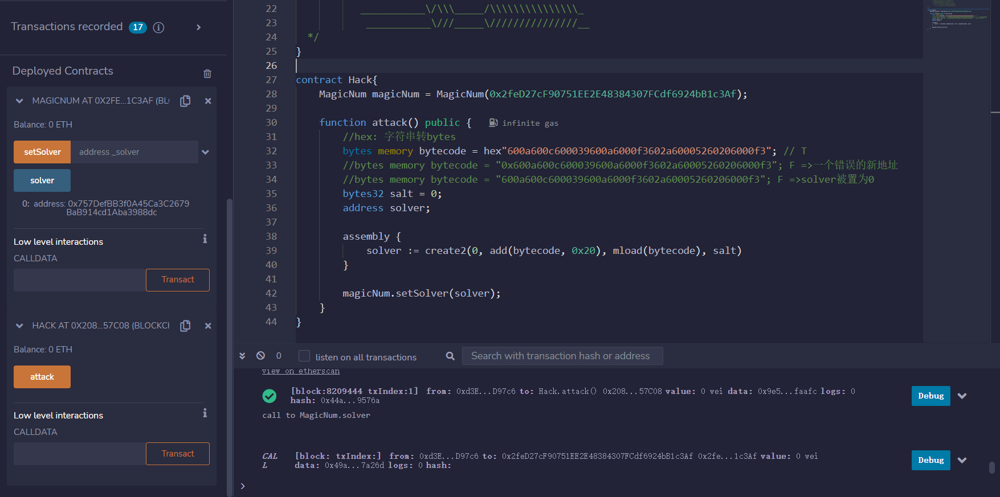
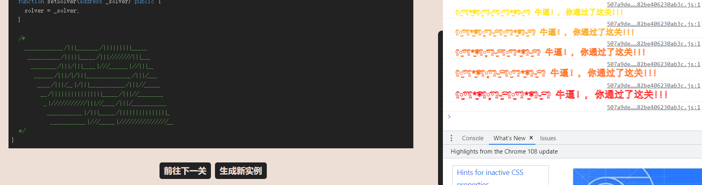

# MagicNumber

## 题目

目标：将solver赋予一个合约，该合约要求：合约的runtime code要求最多10个操作码，并且它返回42（0x2a）

```solidity
// SPDX-License-Identifier: MIT
pragma solidity ^0.8.0;

contract MagicNum {

  address public solver;

  constructor() {}

  function setSolver(address _solver) public {
    solver = _solver;
  }

  /*
    ____________/\\\_______/\\\\\\\\\_____        
     __________/\\\\\_____/\\\///////\\\___       
      ________/\\\/\\\____\///______\//\\\__      
       ______/\\\/\/\\\______________/\\\/___     
        ____/\\\/__\/\\\___________/\\\//_____    
         __/\\\\\\\\\\\\\\\\_____/\\\//________   
          _\///////////\\\//____/\\\/___________  
           ___________\/\\\_____/\\\\\\\\\\\\\\\_ 
            ___________\///_____\///////////////__
  */
}
```

## 分析

要解决这一关，我们需要自己手工创建一个合约，自己写操作码，当然我们首先要懂得一个合约的创建过程：Initialization opcodes 和 Runtime opcodes：

- Initialization opcodes：EVM创建合约并且存储Rumtime opcodes
- Rumtime opcodes：包含我们的实际代码逻辑（即方法）：返回0x2a并且操作码数量不超过10个

### 编写Runtime opcodes

我们的任务是用10个及以内的操作码来返回0x2a。思路：将0x2a存进内存，然后返回

存储0x2a的操作码：`mstore(p, v)`，操作码对应的十六进制值为52，将v的值赋予内存中以p位置开始的32字节

- v：存储的值
- p：位置

返回0x2a的操作码：`RETURN(p,s)`，操作码对应的十六进制值为f3

- p：索引，需要返回的数值在内存中的存放位置，那我们随便选一个吧：0x00。（每一个以太坊交易有2^256字节的临时内存空间使用）
- s：存储数据的大小。用32个字节来存储0x2a，我猜测操作码中一个数值是用32字节来存储的

然后我们来编写操作码：

（1）首先，将0x2a存到内存，使用`mstore(v, p)`操作码

```
602a // v: push1 ox2a (存储0x2a)
6000 // p: push1 ox00 (放到内存的0x00位置)
52 // mstore
```

（2）然后，从内存中把0x2a返回

```
6020 // s:push1 ox20 (0x2a用0x20字节来存储)
6000 // p: push1 0x00 (索引位置，我们放在了0x00)
f3 // RETURN操作码
```

操作码的序列就写好了，按照逻辑顺序连起来就是：`602a60005260206000f3`，刚刚好10个操作码，10个字节长

### 编写Initialization opcodes

具体思路：Initialization opcodes需要先复制runtime opcodes到内存中，然后再将Initialization opcodes返回到EVM。注意：EVM随后会自动将runtime opcodes（602a60005260206000f3）保存到区块链中，所以你不必操心这一步。

复制的操作码：`codecopy(s,f,t)`，从一个位置A复制到另一个位置B

- s：需要复制的内容的代码大小。我们的602a60005260206000f3大小是0x0a
- f：需要复制的字节码的索引。注意：我们现在不知道是多少，因为这个字节码的位置排在Initialization opcodes后面，要先确定Initialization opcodes的大小才可以知道此处是多少
- t：目标保存位置B

（1）Initialization opcodes需要先复制runtime opcodes到内存中

```
600a // s: push1 ox0a (10 bytes)
60?? // f: push1 ox?? (运行时操作码的当前位置)
6000 // t: push1 0x00 (目标内存索引0)
39 // codecopy操作码
```

（2）用RETURN操作码返回内存中的runtime opcodes到EVM中

```
600a // s: push1  ox0a (runtime opcodes的长度)
6000 // p: push1 ox00 (索引位置)
f3 // RETURN操作码
```

（3）我们的Initialization opcodes一共0x0c个字节。那么这就说明，Initialization opcodes后面跟着的runtime opcodes是在0x0c开始的。所以（1）的中代码现在可以补充完整了

```
600a // s: push1 ox0a (10 bytes)
600c // f: push1 0x0c (运行时操作码的当前位置)
6000 // t: push1 0x00 (目标内存索引0)
39 // codecopy操作码
```

（4）连接Initialization opcodes、runtime opcodes，成为最终的bytecode：`0x600a600c600039600a6000f3602a60005260206000f3`。前12字节是Initialization opcodes，后10字节是runtime opcodes

## 攻击代码

使用create2操作码来生成合约

```solidity
contract Hack{
    MagicNum magicNum = MagicNum(0x2feD27cF90751EE2E48384307FCdf6924bB1c3Af);

    function attack() public {
        //hex: 字符串转bytes
        bytes memory bytecode = hex"600a600c600039600a6000f3602a60005260206000f3"; // T
        //bytes memory bytecode = "0x600a600c600039600a6000f3602a60005260206000f3"; F =>一个错误的新地址
        //原因：bytes如果直接用""写内容，里面的内容是会被转换为ASCII码值进行存储
        //     比如:bytes public a = "aa";===>0x6161
        //         bytes public b = hex"aa";====>0xaa
        //bytes memory bytecode = "600a600c600039600a6000f3602a60005260206000f3"; F =>solver被置为0
        bytes32 salt = 0;
        address solver;

        assembly {
            solver := create2(0, add(bytecode, 0x20), mload(bytecode), salt)
        }

        magicNum.setSolver(solver);
    }
}
```

## 做题

获取实例，攻击



通过




引用：[1](https://cmichel.io/ethernaut-solutions/)，[2](https://dac.ac/blog/ethernaut_solutions/#how-i-did-it)，[3](https://medium.com/coinmonks/ethernaut-lvl-19-magicnumber-walkthrough-how-to-deploy-contracts-using-raw-assembly-opcodes-c50edb0f71a2)，[4](https://stermi.medium.com/the-ethernaut-challenge-18-solution-magic-number-2cb8edee383a)
